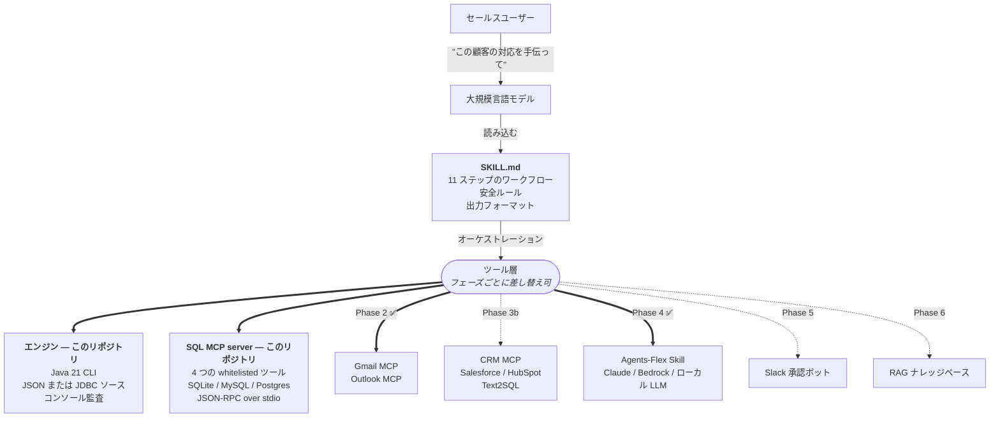
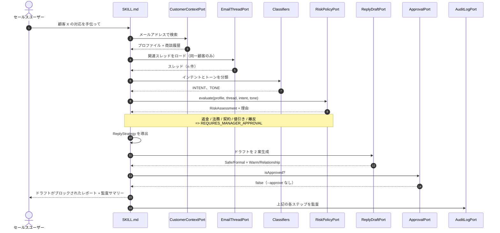
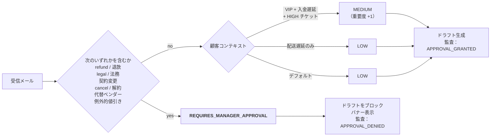

<p align="center">
  
</p>

<p align="center">
  <a href="README.md">English</a> &nbsp;·&nbsp;
  <a href="README.zh-TW.md">繁體中文</a> &nbsp;·&nbsp;
  <strong>日本語</strong> &nbsp;·&nbsp;
  <a href="README.ko.md">한국어</a>
</p>

<p align="center">
  
  
  
  
  
  
</p>

<p align="center"><i>シニアアカウントマネージャーのように顧客のメールを読みこなす AI セールスコパイロット&mdash;&mdash;コンテキストが先、ドラフトは最後、送信ボタンには絶対に触れません。</i></p>

---

## TL;DR

- B2B アカウントマネージャー向けの Java 21 製コパイロットです。まず顧客プロファイルと商談履歴を読み込み、関係するスレッドだけを精読し、インテントとトーンを分類し、明示的なポリシーに照らしてリスクを評価し、返信ドラフト 2 案とフォローアップアクションを出力します。
- これはチャットボットではありません。設計上、コンテキストを起点としています。返金、法務的な表現、契約上の譲歩、例外的な値引き、解約に関する話題、VIP アカウントにおける離反シグナルは、いずれもマネージャー承認ゲートを強制し、**ドラフトをブロック**します。
- 標準 JDK のみ、依存ゼロ、認証情報なし、ネットワーク不要で 60 秒以内に動かせます&mdash;&mdash; [60 秒で動かす](#60-秒で動かす) を参照してください。

## ビジョン

Sales AI のゴールは、**24 時間退勤しない、セールス職能に特化した自動化 AI エージェント**を出荷すること&mdash;&mdash;眠らないセールスエンジンです。

業種を選びません。**既存の顧客データベース、議事録、契約アーカイブ、CRM システムをつなぐだけ**で、このエージェントはシニアアカウントマネージャーのように 24 時間体制で顧客メールに応答します&mdash;&mdash;日中の問い合わせも、深夜の返金要求も、週末の更新質問も、すべて即座に拾います。製造業、金融、SaaS、越境 EC、B2B サービスを問わず、**顧客がメールを書いてくる場所であれば、このエージェントは入っていけます**。

### 今後のロードマップ

- **Phase 4 &mdash; プロアクティブなアウトリーチ。** 受信応答だけではなく、能動的な接触へ。期限切れの提案、満了間近の契約、解約サインの見える顧客に対して、エージェントがドラフトを書き、優先順位を決め、フォロースケジュールを組みます。
- **Phase 5 &mdash; マルチチャネルのメッセージング。** メールから LinkedIn、WhatsApp、LINE 公式アカウント、Slack、サイトのチャットウィジェット、SNS の DM へ&mdash;&mdash;同じ顧客コンテキスト、チャネルを跨いだ一貫した応答。
- **Phase 6 &mdash; 自律クローズ。** マネージャーが事前に定義した価格帯、契約テンプレート、値引き権限の枠内で、見積もり・交渉・契約書サイン・CRM 記録までエージェントが自律的に完走します。日常的なクロージングを人手から本当に切り離します。

### これが企業にもたらす価値

- **売上が「営業の人手」で頭打ちにならない。** 5,000 社をカバーするために以前は営業 30 名が必要だった企業も、5 名 + AI でより高い接触頻度を出せます。
- **応答スピードそのものが武器に。** 業界平均の問い合わせ返信時間は 4&ndash;12 時間。このエージェントは 30 秒以内で返します。**返信の速さがそのまま成約率です**。
- **組織の記憶が辞めない。** 営業が辞めると、顧客履歴、トーキングポイント、案件のコンテキストごと出ていく&mdash;&mdash;B2B 企業最大のロスです。Sales AI はその知識をデータベースに常駐させ、エージェントは毎日それを携えて出社します。
- **マネージャーの時間が、本来使うべき場所へ。** サイン要のケース（返金、契約譲歩、VIP リスク）に集中できます。日常メールの 8 割はもう時間を食いません。
- **デフォルトで監査可能。** 規制業界（銀行、保険、医療）はブラックボックスの AI を運用できません。Sales AI のすべての手順は監査ログに 1 行ずつ書かれ、規制当局、取締役会、外部監査人が「**なぜ**こう返したのか」を読めます。

今日出荷しているのは、コンテキストファーストでハードなマネージャー承認ゲートを持つ MVP です。フェーズが進むにつれゲートは絞られ、自律部分は広がりますが&mdash;&mdash;**ゲートは決してなくなりません**。これが私たちの安全に対する約束です。

## なぜ Java か

Java が流行っているからではありません。このプロジェクトの行き先が、まさに *Java の本拠地*だからです。

| 理由 | このコードベースでどう現れているか |
|---|---|
| **B2B エンタープライズ IT は Java で動いている** | 銀行、保険、製造、ERP/CRM のバックエンド&mdash;&mdash;9 割が Java/Spring。このエージェントを既存サービスの隣、同一プロセス、共通の監査ログ、共通の DI コンテナに埋め込む摩擦は、Python サイドカーよりはるかに低い。 |
| **JDK 21 + 依存ゼロ = 60 秒で再現** | `pip install` の依存解決も、venv も、`node_modules` の闇もなし。`git clone && javac && java`&mdash;&mdash;3 ステップで終わり。Python や Node ではこの綺麗さは出せません。 |
| **records と sealed types はドメインモデルにフィット** | 13 個のドメインレコードは Python `@dataclass` 相当より小さく、安全&mdash;&mdash;コンパイル時の null チェック、enum の網羅、すべてのケースを強制する switch expression。 |
| **監査可能性は「あれば嬉しい」ではなく規制要件** | 返金 / 法務 / 契約のレッドラインは [`RiskRules.java`](src/main/java/com/example/salesai/risk/RiskRules.java) でコンパイル時に網羅が保証される。Python の `if/elif` はブランチ抜けが静かに通る。Java のコンパイラは拒否します。 |
| **MCP エコシステムへの補完** | MCP server は TS/Python が多い&mdash;&mdash;それで構いません。ツール層は言語非依存です。`SKILL.md` こそがエージェント。エンジンの言語はユーザーには関係ありません。Java を選ぶのは「企業内 Java バックエンドへの埋め込みやすさ」への戦略的な賭けです。 |

GitHub 上で「Java 製 AI エージェント」は希少カテゴリ（公開コードの 95% 以上は Python）。すでに Java で動いているエンタープライズ IT チームにとって、自社バックエンドに直接ドロップインできるエージェントは、ハンディキャップではなく明確な差別化要素です。

## 何が違うのか

| | 何を提供するか | なぜ重要か |
|---|---|---|
| **Skill こそがエージェント** | ユーザーに向き合うエージェント本体は [`SKILL.md`](skills/sales-ai/SKILL.md) にあり、コードの中にはありません。Java MVP は単なるエンジンです。 | エンジンをフェーズごとに差し替え（Java CLI &rarr; Gmail MCP &rarr; CRM MCP）しても、お使いの LLM ホストからの呼び方は変わりません。 |
| **ハードな安全ゲート** | 返金 / 法務 / 契約 / 値引き / 離反シグナルは `REQUIRES_MANAGER_APPROVAL` を強制し、**ドラフトをブロック**します。 | 他のエージェントデモはモデルの「お行儀」に頼りますが、本プロジェクトはビルド成果物に SMTP コードを一切含みません。事故ですらメールを送れません。 |
| **プロンプトファーストではなくコンテキストファースト** | 顧客プロファイル、契約、入金、チケット、AM のメモは、モデルがメールを見る**前に**ロードされます。 | シニア AM は頭の中でこれをやっています。LLM にはそれを書き下す必要があります。 |
| **構造的に監査可能** | すべてのポート呼び出しは監査ログを 1 行ずつ書き、CLI はそれをレポート末尾に出力します。 | 判断が誤って見えるなら、レポートから入力に向かって遡れます。 |
| **バイリンガル分類** | キーワードスコアラーが英語と繁体字中国語を同じパスで処理します。次の 2 言語の追加もすぐ差し込める設計です。 | 米国だけのフィクスチャではなく、アジア太平洋の B2B メールのために作られています。 |
| **依存ゼロ、60 秒で再現可能** | 標準 JDK 21、Maven も Gradle も LLM キーもネットワークも不要。 | `git clone && javac && java` でデモが動きます。サプライチェーンも、サプライズもありません。 |

## アーキテクチャ：Skill こそがエージェント

> **Skill こそがエージェント。Java MVP はフェーズごとに差し替え可能なエンジン。**



同じ `SKILL.md` がすべてのフェーズで動きます。太い実線は今日このリポジトリで出荷されるもの — Java エンジンと、4 つの whitelisted クエリツールを備えた SQL MCP server です。点線は将来の置き換え対象 — Gmail / Outlook MCP、本物の CRM、ドラフトポート背後の LLM。**11 ステップのワークフローと安全ルールはフェーズ間で変わりません**&mdash;&mdash;変わるのはポートの背後にある実装だけです。それこそが本プロジェクトの肝です。

これがこのプロジェクトを単なるデモではなく学習素材として有用にしている点です。今日読んでいるエンジンは、いずれ MCP に支えられた本番デプロイがポート単位で置き換えていく、まさにそのエンジンです。完全な移行マップは [`docs/integration-plan.md`](docs/integration-plan.md) にあります。

## 11 ステップのワークフロー



平易な言葉で言い直すと、図と同じ 11 ステップです。

1. 顧客を識別する（CLI 引数の id または email から）。
2. 顧客の商談プロファイルをロードする：ティア、契約状況、入金状況、最近の注文、未解決チケット、アカウントマネージャーのメモ。
3. その顧客の関連メールスレッドをロードする。1 つのスレッドだけ、受信箱全体ではない。
4. スレッドを事実ベースで要約する：誰がいつ何を言ったか、何を求めているか、何を既に約束しているか。
5. ビジネスインテントを次のいずれかに分類する：`INQUIRY`、`QUOTATION`、`COMPLAINT`、`RENEWAL`、`PAYMENT_ISSUE`、`DELIVERY_DELAY`、`TECHNICAL_SUPPORT`、`NEGOTIATION`、`CHURN_RISK`、`UNKNOWN`。
6. 感情的トーンを分類する：中立、苛立ち、エスカレーション中、和解的、緊急、フォーマル。
7. 明示的なポリシーに照らしてリスクを評価する。返金 / 法務 / 契約 / 例外的値引き / 解約 / VIP の離反は、すべて `REQUIRES_MANAGER_APPROVAL` を強制する。
8. 返信戦略を 1〜2 文で決める：受領、コミット、保留、エスカレーション、時間を確保。
9. 返信ドラフトを 2 案生成する。Option A は安全かつフォーマル、Option B は温かく関係性重視。いずれも顧客の希望言語を尊重する。
10. 承認ゲートを表に出す。リスク判断がドラフトをブロックする場合、レポートには `[BLOCKED — manager approval required]` と表示し、提案文面を引用してレビューに供する。
11. レポートと、すべてのポート呼び出しを並べた監査サマリーをレンダリングする。任意で CRM にやり取りを書き戻す。

## リスク判定フロー



返金 / 法務 / 契約 / 解約に類する表現は、顧客ティアやトーンに関わらず**ハードストップ**です。モデルにこのゲートを上書きする手段はありません&mdash;&mdash;ルールは [`risk/RiskRules.java`](src/main/java/com/example/salesai/risk/RiskRules.java) にあり、レビュアーが最初に読むべき場所に配置してあります。完全なポリシーは [`docs/safety-rules.md`](docs/safety-rules.md) にあります。

## サンプル出力

同梱のデモには代表的なケースを 1 件用意しています。Lumora Robotics Co., Ltd.（入金遅延を抱える VIP 顧客）の調達責任者である Wei-Ming Chen 氏が、配送遅延のあった注文に対する一部返金とクレジット付与を要求しており、8 月の更新も雲行きが怪しくなっています。

下のブロックは、同梱サンプルに対して `java -cp out com.example.salesai.SalesAiCli` を実行した際の**実際の stdout** です&mdash;&mdash;スクリーンショットでも、手で整えたモックでもありません。表示されているものはすべて [`app/AdvisorWorkflow.java`](src/main/java/com/example/salesai/app/AdvisorWorkflow.java) の決定的なワークフローが生成し、 [`app/AdvisorReportRenderer.java`](src/main/java/com/example/salesai/app/AdvisorReportRenderer.java) がレンダリングしたものです。完全なトランスクリプトは [`samples/advisor-output.md`](samples/advisor-output.md) にも置いてあります。

```
=== Sales AI — Report ===
!! DRAFTS ARE BLOCKED — manager approval required before this reply can leave the building !!

Customer Context
- Name: Wei-Ming Chen
- Company: Lumora Robotics Co., Ltd.
- Tier: VIP
- Contract status: ACTIVE (renews 2026-08-31)
- Payment status: OVERDUE_30D
- Recent orders:
    * SO-2026-0188 — 2026-04-12 — $42000 — DELIVERED (On-time delivery, signed acceptance)
    * SO-2026-0231 — 2026-04-29 — $18500 — DELAYED (Logistics partner missed ETA by 9 days)
- Recent support state:
    * SUP-7781 [HIGH] since 2026-04-25: Vision module misalignment after firmware 4.2 rollout

Email Summary
- Subject: Order SO-2026-0231 delay + firmware issue — refund expected
- Current intent: TECHNICAL_SUPPORT
- Emotional tone: URGENT
- Key customer ask: Kelly, four days, no plan. Our CTO is now in the loop and is asking about the renewal in August. Please confirm by tomorrow: (1) revised delivery date, (2) refund or credit amount, (3) firmware fix ETA. Otherwise we will pause the renewal d...

Risk Assessment
- Risk level: REQUIRES_MANAGER_APPROVAL
- Reasons:
    * Customer signalled churn risk (mentioned alternative vendors / pause renewal / cancel).
    * Customer asked for refund or credit.
    * VIP customer has an overdue payment (OVERDUE_30D).
    * Customer has an open HIGH-priority support ticket.
- Requires manager approval: YES

Recommended Reply Strategy
- Tone: formal, careful, no commitments (the customer is signalling urgency — acknowledge time pressure explicitly)
- Position: acknowledge, no commitments yet, escalate
- Avoid saying:
    * Promising any contractual concession without manager approval
    * Confirming a refund or credit amount in the reply
- Allowed commitments:
    * Acknowledge receipt and the urgency of the situation today
    * Pull together logistics, engineering, and account management within 24 hours
    * Provide a written status update with concrete dates by end of next business day
- Next best action: Hand off to Kelly Wu with full context; do not reply until approved

Draft Option A: Safe / Formal
Subject: Re: Order SO-2026-0231 delay + firmware issue — refund expected — recovery plan
Body:
Dear Wei-Ming Chen,

Thank you for the directness of your message. I take the points you raised seriously, and I want to address them in order.
I understand the impact this has had on your operations and on your team's confidence in us.

Here is what I can confirm today:
  - Acknowledge receipt and the urgency of the situation today
  - Pull together logistics, engineering, and account management within 24 hours
  - Provide a written status update with concrete dates by end of next business day

Because some of the items you raised — in particular any commercial concession — fall outside what I can confirm in writing today, I am bringing them to Kelly Wu's attention so we can come back to you with a single, signed-off response.

Please consider this message a status update rather than a final commercial response.

Next step from our side: Hand off to Kelly Wu with full context; do not reply until approved

Best regards,
Kelly Wu

Draft Option B: Warm / Relationship-Focused
Subject: Re: Order SO-2026-0231 delay + firmware issue — refund expected — recovery plan
Body:
Hi Wei-Ming Chen,

Thanks for being so direct with me — I'd much rather hear it this way than find out later. Let me address each point.
I know this hasn't been the experience you expected from us, and I'm not going to pretend otherwise.

Here is what I can lock in for you right now:
  - Acknowledge receipt and the urgency of the situation today
  - Pull together logistics, engineering, and account management within 24 hours
  - Provide a written status update with concrete dates by end of next business day

On the commercial side (anything that looks like a refund, credit, or change to the contract), I want to be honest: I won't commit to a number in this email until Kelly Wu has signed it off — that's how we keep our promises clean.

Treat this as me keeping you in the loop, not as the final word on the commercial side.

What I'm doing next: Hand off to Kelly Wu with full context; do not reply until approved

Talk soon,
Kelly Wu

Follow-Up Actions
- Brief the manager — owner: Kelly Wu, due: today
    Walk the manager through the inbound message, the risk reasons, and the proposed reply before any draft leaves the building.
- Engineering update on open ticket — owner: Engineering lead, due: within 48 hours
    Confirm a firmware fix ETA for the open HIGH-priority ticket and write it up in customer-friendly language.
- Schedule executive check-in — owner: Kelly Wu, due: this week
    VIP customer — set up a short call with our account exec to keep the relationship anchored.

Audit Summary
- [...] LOOKUP_CUSTOMER: email=wm.chen@lumora-robotics.example
- [...] LOAD_THREAD: customerEmail=wm.chen@lumora-robotics.example
- [...] CLASSIFY_INTENT: thread=THR-90188
- [...] INTENT_CLASSIFIED: TECHNICAL_SUPPORT
- [...] CLASSIFY_TONE: thread=THR-90188
- [...] TONE_CLASSIFIED: URGENT
- [...] EVALUATE_RISK: intent=TECHNICAL_SUPPORT tone=URGENT
- [...] RISK_LEVEL: REQUIRES_MANAGER_APPROVAL requiresManagerApproval=true
- [...] DECIDE_STRATEGY: level=REQUIRES_MANAGER_APPROVAL
- [...] GENERATE_DRAFTS: tone=formal, careful, no commitments
- [...] RECOMMEND_FOLLOWUPS: intent=TECHNICAL_SUPPORT
- [...] EVALUATE_APPROVAL: requiresManagerApproval=true
- [...] APPROVAL_DENIED: manager flag=false; reasons=[...]
- [...] CRM_RECORD: customerId=CUST-1042 summary=...; drafts BLOCKED

=== End of Report ===
```

`--approve` を付けて再実行しても、メールを送ることはありません。承認を記録する監査行（`APPROVAL_GRANTED`）が 1 行追加され、BLOCKED バナーが消え、末尾の CRM レコードが `drafts READY` に変わるだけです。文面のコピー、メールクライアントへの貼り付け、もう一度の通読、そして送信ボタン押下は、依然として人間の仕事です。これは意図的な摩擦です。詳細は [`docs/safety-rules.md`](docs/safety-rules.md) を参照してください。

> **MVP のドラフトは英語で出力されます**。これはテンプレートアダプターが決定的だからです。顧客の希望言語（ここでは `zh-TW`）でドラフトを生成するのは Phase 4 の範囲です&mdash;&mdash;`TemplateReplyDraftAdapter` が LLM ベースの Agents-Flex Skill に置き換わるタイミングです。詳細は [`docs/integration-plan.md`](docs/integration-plan.md)。戦略とリスク判定は監査可能性を保つため、言語非依存のままにしています。

## 実環境連携（Phase 2 + Phase 4）

モックモードの 60 秒デモは従来通り動きます。実際のシステムに接続するには、以下のオプトイン フラグを使用してください。

| フラグ | 効果 | ドキュメント |
|---|---|---|
| `--email-mcp gmail\|outlook` | 子プロセスとして起動した MCP サーバー経由の実メール | docs/integrations/{gmail,outlook}.md |
| `--mcp-config <path>` | デフォルトの mcp-config.json の場所を上書き | — |
| `--llm anthropic\|openai\|gemini` | 実 LLM によるドラフト生成 | docs/integrations/{anthropic,openai,gemini}.md |
| `--llm openai-compatible --llm-endpoint URL` | **ローカル LLM** — 顧客データを自社境界内に留める | docs/integrations/local-llm.md |
| `--llm-model <id>` | プロバイダーのデフォルトモデルを上書き | — |

### 正直なデプロイメント ノート

- **Java エンジンはランタイム依存ゼロのまま** — `java.net.http` は JDK 11+ に組み込まれているため、LLM HTTP 呼び出しで JAR が増えることはありません。
- **Phase 2 のデプロイは Node.js または `uvx` が必要** — Gmail / Outlook MCP サーバーは子プロセスとして起動する外部 npm/pip パッケージです。Java エンジン自体はゼロ依存のままですが、メールソース側に依存関係が生じます。
- **クラウド LLM を使用する場合、顧客のメール内容がそのプロバイダーに送信されます**（Anthropic/OpenAI/Google）。データをオンプレミスに留める必要がある規制業界（銀行、保険、製造、ERP）では、`--llm openai-compatible` とローカルモデルの組み合わせをご利用ください。詳細は `docs/integrations/local-llm.md` を参照してください。
- **リスクゲートはコードで強制されます**：`RiskAssessment.level().blocksAutoDraft()` が true、または `requiresManagerApproval` が true のとき、LLM は**一切呼び出されません**。高リスク状況では顧客データはエンジン外に出ません。これは `AdvisorWorkflowRiskGateTest` によって検証済みです。

## 60 秒で動かす

必要なのは標準 JDK 21 だけです。ビルドツールも、ネットワークも、認証情報も要りません。

**PowerShell（Windows）：**

```powershell
javac -d out (Get-ChildItem -Recurse src/main/java/*.java | %{$_.FullName})
java -Dstdout.encoding=UTF-8 -cp out com.example.salesai.SalesAiCli
```

> Windows では、コンソールのコードページが 65001 でなくても em ダッシュや中文字を正しく描画させるため、`-Dstdout.encoding=UTF-8` を付けます。すでに `chcp 65001` を実行済みなら省略可能です。

**bash（macOS / Linux / WSL / Git Bash）：**

```bash
find src/main/java -name '*.java' | xargs javac -d out
java -cp out com.example.salesai.SalesAiCli
```

CLI が受け取る flag はわずかです。すべて任意で、デフォルトは同梱のサンプルを指します。

| Flag | 意味 |
|------|------|
| `--customer-profile <path>` | 顧客プロファイル JSON のパス。デフォルトは `samples/customer-profile.json`。 |
| `--email-thread <path>` | メールスレッド JSON のパス。デフォルトは `samples/email-thread.json`。 |
| `--approve` | レポートをマネージャー承認済みとしてマークする。監査行を 1 行追加し、ドラフト表示をアンブロックする。メールは送りません。 |
| `--db <jdbc-url>` | JSON ではなく JDBC データベースから顧客プロファイルを読み込む。`--db-user` / `--db-password` と併用。`--email` の指定が必要。 |

## Phase 2 プレビュー：SQL MCP Server

このリポジトリには、同じ顧客データを **whitelisted な SQL ツール**として任意の MCP 互換 LLM ホストが直接呼び出せる、オプショナルな MCP server も同梱しています。JSON-RPC 2.0 over stdin/stdout、4 ツール、汎用 SQL は提供しません。

```
┌──────────────┐  stdio JSON-RPC  ┌──────────────────────┐  JDBC  ┌──────────┐
│ LLM          │ ───────────────▶ │ SalesMcpServer       │ ─────▶ │ SQLite / │
│ (MCP client) │ ◀─────────────── │  4 つの whitelist ツール│        │ MySQL /  │
└──────────────┘                  └──────────────────────┘        │ Postgres │
                                                                   └──────────┘
```

| MCP ツール | 役割 | 背後 |
|---|---|---|
| `customer.findByEmail` | プライマリメールで顧客を 1 件取得（大文字小文字を無視、完全一致） | 1 本の prepared `SELECT` |
| `customer.findById` | 顧客 id（例：`CUST-1042`）で 1 件取得 | 1 本の prepared `SELECT` |
| `customer.listOrders` | ある顧客の最近の注文を最大 50 件 | 1 本の prepared `SELECT` |
| `customer.listOpenTickets` | ある顧客のオープンなサポートチケット | 1 本の prepared `SELECT` |

**`runSql(query)` のような汎用ツールはありません。今後も追加しません。** このホワイトリストが [`SKILL.md`](skills/sales-ai/SKILL.md) で約束した「scoped reads」をコードで強制する境界です。受信メールに混入したプロンプトインジェクションがエージェントのデータアクセスを広げることはできません — ツールの追加にはコード変更が必要です。

### 90 秒デモ（SQLite、インフラ不要）

```powershell
# 1. SQLite JDBC ドライバを mcp-server/lib/ にダウンロード
Invoke-WebRequest `
  -Uri 'https://repo1.maven.org/maven2/org/xerial/sqlite-jdbc/3.42.0.1/sqlite-jdbc-3.42.0.1.jar' `
  -OutFile 'mcp-server/lib/sqlite-jdbc-3.42.0.1.jar'

# 2. MCP server をコンパイル
$src = Get-ChildItem -Recurse mcp-server/src/main/java -Filter *.java | %{ $_.FullName }
javac -d mcp-server/out -Xlint:all $src

# 3. デモ用 SQLite DB に同じ Lumora Robotics シナリオを投入
java -cp 'mcp-server/lib/sqlite-jdbc-3.42.0.1.jar;mcp-server/out' `
     com.example.salesai.mcp.SeedData

# 4. エンジンを SQLite DB 指定で再実行
java -Dstdout.encoding=UTF-8 `
     -cp 'out;mcp-server/lib/sqlite-jdbc-3.42.0.1.jar' `
     com.example.salesai.SalesAiCli `
     --db jdbc:sqlite:mcp-server/demo.db `
     --email wm.chen@lumora-robotics.example
```

同じレポート、同じリスク判断、同じブロックされたドラフト — 今度は実際の `SELECT` クエリが情報源です。MCP server をお使いの MCP ホストに接続する手順（LLM がエンジンではなく直接ツールを呼べるようにする）は [`mcp-server/README.md`](mcp-server/README.md) を参照してください。設計理由（なぜホワイトリスト、なぜ stdio、汎用 DB MCP があるのになぜ自前で出すのか）は [`docs/mcp-server.md`](docs/mcp-server.md) にあります。

## なぜチャットボットではないのか

チャットボットはプロンプトファーストです。ユーザーが何かを入力し、モデルがそれを読み、返事をする。コンテキストは会話の履歴として遡れる範囲、せいぜい検索で持ち込んだスニペットを足したものです。モデルの仕事は目の前のメッセージに応えることに尽きます。

セールスコパイロットは**コンテキストファースト**です。モデルが顧客のメールを目にする前に、エージェントは顧客のティア、契約状況、入金状況、最近の注文、未解決サポートチケット、アカウントマネージャーのメモをロードしておきます。メールはその背景に対して読まれ、リスク評価もその背景に対して行われ、ドラフトもその背景の編集済みプロジェクションに対して書かれます。順序が肝心です。チャットボットはメールを読んでから「これって誰だっけ？」と問います。コパイロットは何を読むより先に「これは誰か」に答え終えています。

加えて**ハードな安全境界**があります。返金要求、法務的な言及、契約上の譲歩、例外的値引き、解約、VIP アカウントの離反シグナルは、すべてマネージャー承認ゲートを強制します。ドラフトは生成されますが、ブロックされます。監査ログがその理由を正確に説明します。チャットボットにはこのゲートはありません。本エージェントはこれを第一級の出力として持っています。

3 つ目に、チャットボットがしばしば持たないものが監査ログそのものです。ポート呼び出しごとに 1 行が書かれ、CLI は各レポートの末尾に監査サマリーを出力します。レポートの判断が誤って見えるなら、結論からそれを生んだステップへと遡って読めます。**モデルが読み解ける形になっています。**

## Port &rarr; MCP 移行

完全なアーキテクチャは [`docs/architecture.md`](docs/architecture.md) にあります。要点はこうです。ヘキサゴナル構造、DI フレームワーク不使用、ドメインは Java 21 の record、JSON は Jackson でも Gson でもなく手書きリーダー、そして port &rarr; MCP のクリーンな対応がロードマップ全体を駆動します。

| Port | 将来の置き換え先 |
|------|---------|
| `CustomerContextPort` | CRM MCP サーバー、顧客 DB に対する Text2SQL |
| `EmailThreadPort` | Gmail MCP / Outlook MCP / IMAP MCP |
| `RiskPolicyPort` | ポリシーエンジン、最終的には構造化出力を持つ LLM |
| `ReplyDraftPort` | Agents-Flex Skill 経由の LLM |
| `CrmPort` | CRM MCP の書き込み操作 |
| `ApprovalPort` | Slack 承認ボット、チケッティングシステム |
| `AuditLogPort` | OpenTelemetry、Splunk、内部監査 DB |

[`docs/integration-plan.md`](docs/integration-plan.md) の各フェーズはこのうち 1〜2 個のポートを置き換えます。残りのパッケージは動きません。

## ロードマップ

- [x] **Phase 1 &mdash; MVP。** モックアダプター、決定的な分類器、コンソール監査。本リポジトリ。
- [x] **Phase 2 &mdash; 実メール。** ✅ `--email-mcp` で `MockEmailThreadAdapter` を Gmail MCP / Outlook MCP に置換。読み取りは引き続き顧客スコープ。
- [x] **Phase 3a &mdash; 実データベース。** `JdbcCustomerContextAdapter` と、4 つの whitelisted クエリツールを備えた SQL MCP server。デモは SQLite、MySQL / Postgres スキーマも同梱済み。詳細は [`mcp-server/`](mcp-server/) と [`docs/mcp-server.md`](docs/mcp-server.md)。
- [ ] **Phase 3b &mdash; 本番 CRM。** Text2SQL がスコープに入った段階で、同じ JDBC アダプターと同じ MCP ツールを実 CRM（Salesforce、HubSpot）に向ける。
- [x] **Phase 4 &mdash; 実 LLM ドラフト。** ✅ `--llm anthropic|openai|gemini` または `--llm openai-compatible` とローカルモデルで `TemplateReplyDraftAdapter` を置換し、安定したプリアンブルにプロンプトキャッシュを効かせる。
- [ ] **Phase 5 &mdash; 承認ルーティング。** `ManualApprovalAdapter` を Slack 承認ボットまたはチケッティングシステム連携に置換。
- [ ] **Phase 6 &mdash; ナレッジベース / RAG。** 過去の受注／失注プレイブックのベクトルストアを新しいポートの裏に差し込む。
- [ ] **Phase 7 &mdash; Spring Boot サービス。** ワークフローを Spring Boot で包み、Skill 形式に対応する他の LLM ホストから呼べる MCP サーバーとして公開する。

各フェーズの詳細な形、それが導入する新たな安全考慮事項、そして意図的に**要求しない** OAuth スコープは [`docs/integration-plan.md`](docs/integration-plan.md) にまとめてあります。

## コードではなくパターンを借りる

本プロジェクトは複数のオープンソース成果物に対し、概念上の明確な負い目があります。**ただし、それらのソースコードは本リポジトリに 1 行も入っていません。**

- [Agents-Flex](https://github.com/agents-flex/agents-flex) &mdash; Java エージェントフレームワーク。Skill を仕様として扱う思想と、Phase 4 で Agents-Flex Skill が差し込まれる前提に合わせた port / adapter の形を採用しました。ソースファイル、パッケージレイアウト、クラス名のいずれもコピーしていません。
- [marlinjai/email-mcp](https://github.com/marlinjai/email-mcp) &mdash; プロバイダー横断の統一メール MCP。`EmailThreadPort` に「単一ポートで複数プロバイダーを扱う」形を採用しました。MCP サーバーを出荷するのではなく、消費する計画です。
- 公開されている Gmail MCP サーバーの例 &mdash; スレッド読み取り、メッセージ読み取り、ドラフト作成、承認後送信。スレッド単位の読み取り、送信前にドラフトを置く流れ、書き込み前承認の姿勢を採用しました。
- 公開されている CRM MCP サーバーの例 &mdash; 顧客取得、`recordInteraction` 風の書き込み。読み取り中心の書き込み面と、構造化ペイロードでの書き込み形を採用しました。

これらのプロジェクトのソースコードを vendor したりフォークしたりコピーしたりはしていません。プロジェクトごとに何を採用し、何を明示的に採用しなかったかの内訳は [`docs/borrowed-patterns.md`](docs/borrowed-patterns.md) にあります。

## Skill として使う（任意の MCP ホストに対応）

エージェント定義は [`skills/sales-ai/SKILL.md`](skills/sales-ai/SKILL.md) にあります。`skills/sales-ai/` フォルダーをそのままお使いの MCP ホストの skills ディレクトリに置く（あるいはプロジェクトローカルのものを使う）と、LLM にこんな依頼ができます。

- "幫我看一下王經理那封信怎麼回。"
- "Take a look at the Lumora thread &mdash; Wei-Ming is asking for a refund."
- "Customer CUST-1042 just escalated. Walk me through it."
- 「Lumora の Wei-Ming さんからのメール、どう返すか一緒に考えてもらえますか。」

LLM ホストは Skill に書かれた 11 ステップのワークフローに従い、ツール層として同梱の Java CLI を呼び出し、レポートを提示します。リスク判定が `REQUIRES_MANAGER_APPROVAL` なら、ドラフトがブロックされていることを伝え、明示的な承認が出るまで止まります。

> **参照実装として [Claude Code](https://claude.ai/code) を MCP ホストとして検証しています。`SKILL.md` を読み取れる任意の MCP 互換 LLM エージェントランタイムで動作するはずです。**

## ドキュメント

| ドキュメント | 内容 |
|-----|--------------|
| [`docs/architecture.md`](docs/architecture.md) | ヘキサゴナル構造、パッケージ境界、なぜ DI を使わないか、なぜ JSON リーダーを手書きしたか、拡張ポイント。 |
| [`docs/safety-rules.md`](docs/safety-rules.md) | すべてのレッドライン、それぞれの**なぜ**と**どう強制するか**。 |
| [`docs/integration-plan.md`](docs/integration-plan.md) | MCP / Agents-Flex / Spring Boot に向けたフェーズごとの移行計画。要求する／しない OAuth スコープ。 |
| [`docs/borrowed-patterns.md`](docs/borrowed-patterns.md) | 参考プロジェクトごとに採用したパターンと、明示的にコピーしなかったソースコードの内訳。 |
| [`docs/mcp-server.md`](docs/mcp-server.md) | SQL MCP server の設計理由：なぜホワイトリスト、なぜ stdio、なぜ自前で出すのか。 |
| [`mcp-server/README.md`](mcp-server/README.md) | MCP server のコンパイル、シード投入、お使いの MCP ホストへの接続手順。 |
| [`samples/advisor-output.md`](samples/advisor-output.md) | デフォルト実行と `--approve` 付き実行の出力をそのまま収録。 |
| [`skills/sales-ai/SKILL.md`](skills/sales-ai/SKILL.md) | エージェント定義。実質的なプロダクト本体。 |

## 一緒に育てましょう

Sales AI を GitHub のデモではなく、本物のプロダクトに育てたい方&mdash;&mdash;star を付けて立ち去るだけでなく一緒に作りたい方&mdash;&mdash;ご連絡ください。

探しているのは：

- **B2B セールス／アカウントマネージャー**：日々のメール + CRM + 上長承認の苦痛を実感していて、自分のワークフローでコパイロットを試したい方。
- **Java エンジニア**：エンタープライズ環境（銀行、保険、製造、ERP&mdash;&mdash;Java が母語の現場）で AI エージェントを本番稼働させることに興味がある方。
- **投資家 / 共同創業パートナー**：セールス自動化が次の波だと信じていて、「Java first、監査優先」のアプローチを支持したい方。
- **デザインパートナー**：自社のセールスチームでエージェントを試験運用し、実際の顧客データでロードマップを共に形作っていただける企業。

📩 **a0925281767s@gmail.com**

どのカテゴリに当てはまるか、どんな顧客に売っているか、何があれば本当に役立つかを教えてください。「面白いデモ」から「出荷できるプロダクト」へ最短でたどり着くには、実際に使う人と一緒に作るのが一番です。

## コントリビュート

issue、提案、反例を歓迎します&mdash;&mdash;特に反例を。本エージェントが下手に対応してしまうリクエスト（誤分類されたスレッド、本来トリガーされるべきだった承認ゲートが発動しなかったケース、社内向けフィールドが漏れているドラフトなど）を見つけたら、その悪い出力を生んだ入力とともに issue を立ててください。 [`docs/safety-rules.md`](docs/safety-rules.md) の安全ルールがプロダクトそのものであり、それを守ることが最も価値あるコントリビュートです。

## ライセンス

MIT。詳細は [`LICENSE`](LICENSE)。

## Suggested GitHub topics

`java` · `java21` · `ai-agent` · `email-copilot` · `sales-automation` · `mcp` · `agents-flex` · `claude-code` · `hexagonal-architecture` · `llm-tools` · `account-management` · `b2b`
