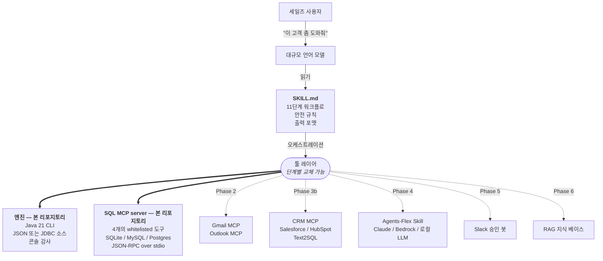
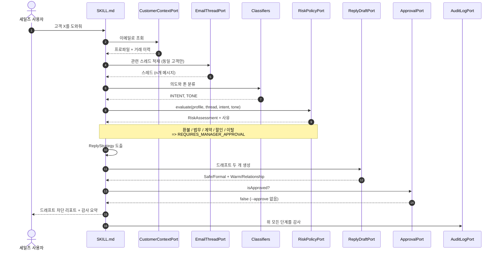
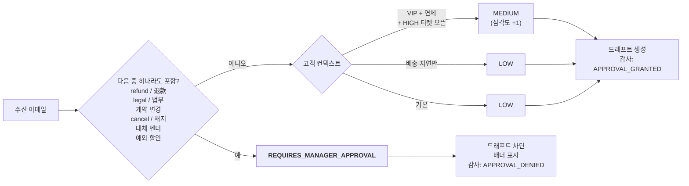

<p align="center">
  
</p>

<p align="center">
  <a href="README.md">English</a> &nbsp;·&nbsp;
  <a href="README.zh-TW.md">繁體中文</a> &nbsp;·&nbsp;
  <a href="README.ja.md">日本語</a> &nbsp;·&nbsp;
  <strong>한국어</strong>
</p>

<p align="center">
  
  
  
  
  
  
</p>

<p align="center"><i>시니어 어카운트 매니저처럼 고객 이메일을 읽어 내는 AI 세일즈 코파일럿입니다&mdash;&mdash;컨텍스트가 먼저, 드래프트는 마지막, 전송 버튼은 절대 누르지 않습니다.</i></p>

---

## TL;DR

- B2B 어카운트 매니저를 위한 Java 21 기반 코파일럿입니다. 먼저 고객 프로파일과 거래 이력을 적재하고, 관련 스레드만 읽으며, 의도와 톤을 분류하고, 명시적 정책으로 리스크를 평가한 뒤, 답장 드래프트 두 개와 후속 액션을 산출합니다.
- 이것은 챗봇이 아닙니다. 설계상 컨텍스트 우선입니다. 환불, 법무 표현, 계약상 양보, 예외 할인, 해지 언급, VIP 계정의 이탈 신호는 모두 매니저 승인 게이트를 강제하고 **드래프트를 차단**합니다.
- 표준 JDK만으로, 의존성도 자격증명도 네트워크도 없이 60초 안에 실행할 수 있습니다&mdash;&mdash;[60초 안에 실행하기](#60초-안에-실행하기) 항목을 참조하세요.

## 비전

Sales AI의 목표는 **24시간 퇴근하지 않고 영업 기능에 집중하는 자동화 AI 에이전트**를 출시하는 것입니다&mdash;&mdash;잠들지 않는 영업 엔진.

특정 산업에 묶이지 않습니다. **기존의 고객 데이터베이스, 회의록, 계약 아카이브, CRM 시스템을 연결하기만 하면**, 이 에이전트는 시니어 어카운트 매니저처럼 24시간 고객 이메일에 응대합니다&mdash;&mdash;낮의 문의도, 한밤중의 환불 요구도, 주말의 갱신 질문도 모두 즉시 받아냅니다. 제조업, 금융, SaaS, 크로스보더 이커머스, B2B 서비스&mdash;&mdash;**고객이 이메일을 쓰는 곳이라면, 이 에이전트는 들어갑니다**.

### 다음 로드맵

- **Phase 4 &mdash; 능동적 아웃리치.** 수신 응답에 그치지 않고 먼저 다가갑니다. 기한 지난 제안, 만료가 다가오는 계약, 명확한 이탈 신호가 있는 고객&mdash;&mdash;에이전트가 메시지를 작성하고, 우선순위를 정하고, 후속 일정을 잡습니다.
- **Phase 5 &mdash; 멀티채널 메시징.** 이메일에서 LinkedIn, WhatsApp, LINE 공식 계정, Slack, 웹사이트 챗 위젯, SNS DM까지&mdash;&mdash;동일한 고객 컨텍스트, 채널을 가로지르는 일관된 보이스.
- **Phase 6 &mdash; 자율 클로징.** 매니저가 미리 정의한 가격 범위, 계약 템플릿, 할인 권한 내에서 견적, 협상, 계약 서명, CRM 기록까지 에이전트가 자율적으로 완주합니다. 일상적인 클로징을 사람의 손에서 진정으로 떼어냅니다.

### 이것이 회사에 주는 가치

- **매출이 "영업 인력 부족"에 막히지 않습니다.** 5,000개 고객사를 커버하려면 영업 30명이 필요했던 회사도, 5명 + AI로 더 높은 접촉 빈도를 낼 수 있습니다.
- **응답 속도 자체가 무기가 됩니다.** 업계 평균 문의 답신 시간은 4&ndash;12시간. 이 에이전트는 30초 이내에 답합니다. **답신 속도가 곧 전환율입니다**.
- **조직의 기억이 떠나지 않습니다.** 영업이 퇴사할 때 고객 이력, 토킹 포인트, 계약 컨텍스트가 함께 빠져나갑니다&mdash;&mdash;B2B 회사가 가장 두려워하는 비강제적 손실입니다. Sales AI는 그 지식을 데이터베이스에 상주시키고, 에이전트는 매일 그것을 안고 출근합니다.
- **매니저의 시간이 본래 써야 할 곳으로.** 서명이 필요한 케이스(환불, 계약 양보, VIP 리스크)에 집중할 수 있습니다. 나머지 80%의 일상 메일은 더 이상 시간을 잡아먹지 않습니다.
- **기본값으로 감사 가능.** 규제 산업(은행, 보험, 의료)은 블랙박스 에이전트를 운영할 수 없습니다. Sales AI의 모든 단계는 감사 로그에 한 줄씩 기록되고, 규제 당국, 이사회, 외부 감사인이 "**왜**" 이렇게 답했는지 읽을 수 있습니다.

오늘 출시되는 것은 컨텍스트 우선이며 하드한 매니저 승인 게이트가 있는 MVP입니다. 페이즈가 진행됨에 따라 게이트는 좁아지고 자율 영역은 넓어지지만&mdash;&mdash;**게이트는 결코 사라지지 않습니다**. 이것이 우리의 안전 약속입니다.

## 왜 Java인가

Java가 트렌디해서가 아닙니다. 이 프로젝트가 가야 할 곳이 바로 *Java의 본진*이기 때문입니다.

| 이유 | 이 코드베이스에서 어떻게 드러나는가 |
|---|---|
| **B2B 엔터프라이즈 IT는 Java로 돌아간다** | 은행, 보험, 제조, ERP/CRM 백엔드&mdash;&mdash;90%가 Java/Spring. 이 에이전트를 기존 서비스 옆, 같은 프로세스, 같은 감사 로그, 같은 DI 컨테이너에 끼워 넣는 마찰은 Python 사이드카보다 훨씬 낮습니다. |
| **JDK 21 + 의존성 0 = 60초 재현** | `pip install` 충돌 해결, venv, `node_modules` 블랙홀 모두 없습니다. `git clone && javac && java`&mdash;&mdash;세 단계로 끝. Python과 Node로는 이렇게 깔끔하게 출시할 수 없습니다. |
| **records와 sealed types는 도메인 모델에 적합** | 13개의 도메인 레코드는 Python `@dataclass` 대비 더 작고 더 안전&mdash;&mdash;컴파일 타임 null 체크, enum 망라, 모든 케이스를 강제하는 switch expression. |
| **감사 가능성은 규제 요구사항이지 부가가치가 아닙니다** | 환불 / 법무 / 계약 같은 레드라인은 [`RiskRules.java`](src/main/java/com/example/salesai/risk/RiskRules.java)에서 컴파일 타임에 망라가 보장됩니다. Python의 `if/elif`는 분기 누락이 조용히 통과되지만, Java 컴파일러는 거부합니다. |
| **MCP 생태계와 상호 보완적** | MCP server 대부분은 TS/Python&mdash;&mdash;괜찮습니다. 도구 계층은 언어 중립이니까요. `SKILL.md`가 에이전트 본체이고, 엔진의 언어는 사용자에게 중요하지 않습니다. Java를 선택하는 것은 "기업 내 Java 백엔드에 끼워 넣기 쉬움"에 대한 전략적 베팅입니다. |

GitHub에서 "Java로 작성된 AI 에이전트"는 희귀 카테고리입니다(공개된 AI 에이전트 코드의 95% 이상이 Python). 이미 Java 스택 위에서 돌아가고 있는 엔터프라이즈 IT 팀에게는, 자사 백엔드에 직접 드롭인할 수 있는 에이전트가 핸디캡이 아니라 명확한 차별화 요소입니다.

## 무엇이 다른가

| | 무엇을 제공하는가 | 왜 중요한가 |
|---|---|---|
| **Skill 자체가 에이전트** | 사용자 대면 에이전트는 코드가 아니라 [`SKILL.md`](skills/sales-ai/SKILL.md) 안에 있습니다. Java MVP는 단지 엔진입니다. | 엔진을 단계별로 교체(Java CLI &rarr; Gmail MCP &rarr; CRM MCP)하더라도 Claude Code가 호출하는 방식은 바뀌지 않습니다. |
| **하드한 안전 게이트** | 환불 / 법무 / 계약 / 할인 / 이탈 신호는 `REQUIRES_MANAGER_APPROVAL`을 강제하고 **드래프트를 차단**합니다. | 다른 에이전트 데모는 모델이 "얌전히 굴기"를 기대하지만, 본 프로젝트의 빌드 산출물에는 SMTP 코드가 아예 없습니다. 사고로도 메일을 보낼 수 없습니다. |
| **프롬프트 우선이 아닌 컨텍스트 우선** | 고객 프로파일, 계약, 결제, 티켓, AM 메모는 모델이 이메일을 보기 **전에** 적재됩니다. | 시니어 AM은 이를 머릿속에서 합니다. LLM에게는 명시적으로 적어 주어야 합니다. |
| **구조적으로 감사 가능** | 모든 포트 호출은 한 줄의 감사 로그를 남기고, CLI는 그 로그를 모든 리포트 하단에 출력합니다. | 결정이 어색해 보인다면 리포트에서 입력으로 거꾸로 따라 읽으면 됩니다. |
| **이중 언어 분류** | 키워드 스코어러가 영어와 번체 중국어를 같은 패스에서 처리합니다. 다음 두 언어를 바로 끼워 넣을 수 있도록 설계했습니다. | 미국 전용 픽스처가 아니라 아시아 태평양 B2B 메일을 위해 만들어졌습니다. |
| **의존성 0, 60초 안에 재현 가능** | 표준 JDK 21, Maven도 Gradle도 LLM 키도 네트워크도 필요 없습니다. | `git clone && javac && java`만으로 데모가 동작합니다. 공급망도, 깜짝 놀랄 일도 없습니다. |

## 아키텍처: Skill 자체가 에이전트

> **Skill 자체가 에이전트입니다. Java MVP는 단계별로 교체 가능한 엔진입니다.**



같은 `SKILL.md`가 모든 단계에서 동작합니다. 굵은 실선은 오늘 이 리포지토리에서 출시되는 것 — Java 엔진과 4개의 whitelisted 쿼리 도구를 갖춘 SQL MCP server입니다. 점선은 향후 교체될 부분 — Gmail / Outlook MCP, 실제 CRM, 드래프트 포트 뒤의 LLM. **11단계 워크플로와 안전 규칙은 단계 사이에 변하지 않습니다**&mdash;&mdash;바뀌는 것은 포트 뒤의 구현뿐입니다. 그것이 이 설계의 핵심입니다.

이 점이 본 프로젝트를 단순한 데모가 아니라 학습용 자료로 유용하게 만듭니다. 오늘 읽고 있는 이 엔진이, 결국 MCP 기반 프로덕션 배포가 포트 단위로 교체해 나갈 바로 그 엔진입니다. 전체 마이그레이션 지도는 [`docs/integration-plan.md`](docs/integration-plan.md)에 있습니다.

## 11단계 워크플로



쉬운 말로 풀면, 다이어그램이 보여 주는 것과 같은 11단계입니다.

1. 고객을 식별합니다 (CLI 인자의 id 또는 email로).
2. 고객의 거래 프로파일을 적재합니다: 등급, 계약 상태, 결제 상태, 최근 주문, 미해결 티켓, 어카운트 매니저 메모.
3. 해당 고객의 관련 이메일 스레드를 적재합니다. 한 스레드만, 받은편지함 전체가 아닙니다.
4. 스레드를 사실 기반으로 요약합니다: 누가 언제 무엇을 말했는지, 무엇을 묻고 있는지, 우리가 이미 약속한 것은 무엇인지.
5. 비즈니스 의도를 다음 중 하나로 분류합니다: `INQUIRY`, `QUOTATION`, `COMPLAINT`, `RENEWAL`, `PAYMENT_ISSUE`, `DELIVERY_DELAY`, `TECHNICAL_SUPPORT`, `NEGOTIATION`, `CHURN_RISK`, `UNKNOWN`.
6. 감정 톤을 분류합니다: 중립, 불만, 격화, 회유, 긴급, 또는 격식.
7. 명시적 정책으로 리스크를 평가합니다. 환불 / 법무 / 계약 / 예외 할인 / 해지 / VIP 이탈은 모두 `REQUIRES_MANAGER_APPROVAL`을 강제합니다.
8. 답장 전략을 한두 문장으로 결정합니다: 인지, 약속, 보류, 에스컬레이션, 시간 확보.
9. 답장 드래프트를 두 개 생성합니다: Option A는 안전하고 격식 있게, Option B는 따뜻하고 관계 중심으로. 두 드래프트 모두 고객의 선호 언어를 따릅니다.
10. 승인 게이트를 표면에 드러냅니다. 리스크 결정이 드래프트를 차단하면, 리포트에 `[BLOCKED — manager approval required]`로 표시하고 제안 문구를 검토용으로 인용합니다.
11. 리포트와, 모든 포트 호출을 나열한 감사 요약을 렌더링합니다. 선택적으로 상호작용을 CRM에 다시 기록합니다.

## 리스크 결정 흐름



환불 / 법무 / 계약 / 해지 표현은 고객 등급이나 톤과 무관하게 **하드 스톱**입니다. 모델은 이 게이트를 우회할 수단이 없습니다&mdash;&mdash;이 규칙은 [`risk/RiskRules.java`](src/main/java/com/example/salesai/risk/RiskRules.java)에 있으며, 리뷰어가 가장 먼저 읽게 되는 위치에 두었습니다. 전체 정책은 [`docs/safety-rules.md`](docs/safety-rules.md)에 있습니다.

## 샘플 출력

번들 데모에는 대표적인 케이스 한 건이 들어 있습니다. Lumora Robotics Co., Ltd.(결제가 연체된 VIP 고객)의 구매 책임자인 Wei-Ming Chen 씨가, 지연된 주문에 대한 부분 환불과 크레딧을 요구하고 있고, 8월 갱신도 이제 흔들리는 상황입니다.

아래 블록은 번들 샘플에 대해 `java -cp out com.example.salesai.SalesAiCli`를 실행한 **실제 stdout**입니다&mdash;&mdash;스크린샷도, 손으로 다듬은 목업도 아닙니다. 보이는 모든 것은 [`app/AdvisorWorkflow.java`](src/main/java/com/example/salesai/app/AdvisorWorkflow.java)의 결정적 워크플로가 만들고 [`app/AdvisorReportRenderer.java`](src/main/java/com/example/salesai/app/AdvisorReportRenderer.java)가 렌더링한 것입니다. 전체 트랜스크립트는 [`samples/advisor-output.md`](samples/advisor-output.md)에도 있습니다.

```
=== Sales AI — Report ===
!! DRAFTS ARE BLOCKED — manager approval required before this reply can leave the building !!

Customer Context
- Name: Wei-Ming Chen
- Company: Lumora Robotics Co., Ltd.
- Tier: VIP
- Contract status: ACTIVE (renews 2026-08-31)
- Payment status: OVERDUE_30D
- Recent orders:
    * SO-2026-0188 — 2026-04-12 — $42000 — DELIVERED (On-time delivery, signed acceptance)
    * SO-2026-0231 — 2026-04-29 — $18500 — DELAYED (Logistics partner missed ETA by 9 days)
- Recent support state:
    * SUP-7781 [HIGH] since 2026-04-25: Vision module misalignment after firmware 4.2 rollout

Email Summary
- Subject: Order SO-2026-0231 delay + firmware issue — refund expected
- Current intent: TECHNICAL_SUPPORT
- Emotional tone: URGENT
- Key customer ask: Kelly, four days, no plan. Our CTO is now in the loop and is asking about the renewal in August. Please confirm by tomorrow: (1) revised delivery date, (2) refund or credit amount, (3) firmware fix ETA. Otherwise we will pause the renewal d...

Risk Assessment
- Risk level: REQUIRES_MANAGER_APPROVAL
- Reasons:
    * Customer signalled churn risk (mentioned alternative vendors / pause renewal / cancel).
    * Customer asked for refund or credit.
    * VIP customer has an overdue payment (OVERDUE_30D).
    * Customer has an open HIGH-priority support ticket.
- Requires manager approval: YES

Recommended Reply Strategy
- Tone: formal, careful, no commitments (the customer is signalling urgency — acknowledge time pressure explicitly)
- Position: acknowledge, no commitments yet, escalate
- Avoid saying:
    * Promising any contractual concession without manager approval
    * Confirming a refund or credit amount in the reply
- Allowed commitments:
    * Acknowledge receipt and the urgency of the situation today
    * Pull together logistics, engineering, and account management within 24 hours
    * Provide a written status update with concrete dates by end of next business day
- Next best action: Hand off to Kelly Wu with full context; do not reply until approved

Draft Option A: Safe / Formal
Subject: Re: Order SO-2026-0231 delay + firmware issue — refund expected — recovery plan
Body:
Dear Wei-Ming Chen,

Thank you for the directness of your message. I take the points you raised seriously, and I want to address them in order.
I understand the impact this has had on your operations and on your team's confidence in us.

Here is what I can confirm today:
  - Acknowledge receipt and the urgency of the situation today
  - Pull together logistics, engineering, and account management within 24 hours
  - Provide a written status update with concrete dates by end of next business day

Because some of the items you raised — in particular any commercial concession — fall outside what I can confirm in writing today, I am bringing them to Kelly Wu's attention so we can come back to you with a single, signed-off response.

Please consider this message a status update rather than a final commercial response.

Next step from our side: Hand off to Kelly Wu with full context; do not reply until approved

Best regards,
Kelly Wu

Draft Option B: Warm / Relationship-Focused
Subject: Re: Order SO-2026-0231 delay + firmware issue — refund expected — recovery plan
Body:
Hi Wei-Ming Chen,

Thanks for being so direct with me — I'd much rather hear it this way than find out later. Let me address each point.
I know this hasn't been the experience you expected from us, and I'm not going to pretend otherwise.

Here is what I can lock in for you right now:
  - Acknowledge receipt and the urgency of the situation today
  - Pull together logistics, engineering, and account management within 24 hours
  - Provide a written status update with concrete dates by end of next business day

On the commercial side (anything that looks like a refund, credit, or change to the contract), I want to be honest: I won't commit to a number in this email until Kelly Wu has signed it off — that's how we keep our promises clean.

Treat this as me keeping you in the loop, not as the final word on the commercial side.

What I'm doing next: Hand off to Kelly Wu with full context; do not reply until approved

Talk soon,
Kelly Wu

Follow-Up Actions
- Brief the manager — owner: Kelly Wu, due: today
    Walk the manager through the inbound message, the risk reasons, and the proposed reply before any draft leaves the building.
- Engineering update on open ticket — owner: Engineering lead, due: within 48 hours
    Confirm a firmware fix ETA for the open HIGH-priority ticket and write it up in customer-friendly language.
- Schedule executive check-in — owner: Kelly Wu, due: this week
    VIP customer — set up a short call with our account exec to keep the relationship anchored.

Audit Summary
- [...] LOOKUP_CUSTOMER: email=wm.chen@lumora-robotics.example
- [...] LOAD_THREAD: customerEmail=wm.chen@lumora-robotics.example
- [...] CLASSIFY_INTENT: thread=THR-90188
- [...] INTENT_CLASSIFIED: TECHNICAL_SUPPORT
- [...] CLASSIFY_TONE: thread=THR-90188
- [...] TONE_CLASSIFIED: URGENT
- [...] EVALUATE_RISK: intent=TECHNICAL_SUPPORT tone=URGENT
- [...] RISK_LEVEL: REQUIRES_MANAGER_APPROVAL requiresManagerApproval=true
- [...] DECIDE_STRATEGY: level=REQUIRES_MANAGER_APPROVAL
- [...] GENERATE_DRAFTS: tone=formal, careful, no commitments
- [...] RECOMMEND_FOLLOWUPS: intent=TECHNICAL_SUPPORT
- [...] EVALUATE_APPROVAL: requiresManagerApproval=true
- [...] APPROVAL_DENIED: manager flag=false; reasons=[...]
- [...] CRM_RECORD: customerId=CUST-1042 summary=...; drafts BLOCKED

=== End of Report ===
```

`--approve`를 붙여 다시 실행해도 메일을 보내지 않습니다. 승인을 기록하는 감사 행(`APPROVAL_GRANTED`) 한 줄을 추가하고, BLOCKED 배너를 떼고, 마지막 CRM 레코드를 `drafts READY`로 바꿀 뿐입니다. 사람이 문구를 복사해 메일 클라이언트에 붙여 넣고, 한 번 더 읽고, 전송 버튼을 누르는 일은 여전히 사람의 몫입니다. 이는 의도된 마찰입니다. 자세한 내용은 [`docs/safety-rules.md`](docs/safety-rules.md)를 참조하세요.

> **MVP의 드래프트는 영어로 출력됩니다**. 템플릿 어댑터가 결정적이기 때문입니다. 고객의 선호 언어(여기서는 `zh-TW`)로 드래프트를 생성하는 것은 Phase 4의 범위입니다&mdash;&mdash;`TemplateReplyDraftAdapter`가 LLM 기반 Agents-Flex Skill로 교체되는 시점이며, 자세한 내용은 [`docs/integration-plan.md`](docs/integration-plan.md)에 있습니다. 전략과 리스크 결정은 감사 가능성을 유지하기 위해 언어 비의존적으로 둡니다.

## 60초 안에 실행하기

표준 JDK 21 외에는 아무것도 필요하지 않습니다. 빌드 도구도, 네트워크도, 자격증명도 필요 없습니다.

**PowerShell (Windows):**

```powershell
javac -d out (Get-ChildItem -Recurse src/main/java/*.java | %{$_.FullName})
java -Dstdout.encoding=UTF-8 -cp out com.example.salesai.SalesAiCli
```

> Windows에서는 콘솔 코드 페이지가 65001이 아니어도 em 대시와 한자/한글이 올바르게 렌더링되도록 `-Dstdout.encoding=UTF-8` 플래그를 사용합니다. 이미 `chcp 65001`을 실행했다면 이 플래그는 생략해도 됩니다.

**bash (macOS / Linux / WSL / Git Bash):**

```bash
find src/main/java -name '*.java' | xargs javac -d out
java -cp out com.example.salesai.SalesAiCli
```

CLI는 소수의 플래그만 받습니다. 모두 선택 사항이며, 기본값은 번들 샘플을 가리킵니다.

| Flag | 의미 |
|------|------|
| `--customer-profile <path>` | 고객 프로파일 JSON 경로. 기본값은 `samples/customer-profile.json`. |
| `--email-thread <path>` | 이메일 스레드 JSON 경로. 기본값은 `samples/email-thread.json`. |
| `--approve` | 리포트를 매니저 승인된 것으로 표시합니다. 감사 행을 한 줄 추가하고 드래프트 표시를 해제합니다. 메일을 보내지는 않습니다. |
| `--db <jdbc-url>` | JSON 대신 JDBC 데이터베이스에서 고객 프로파일을 읽어옵니다. `--db-user` / `--db-password`와 함께 사용. `--email` 지정 필수. |

## Phase 2 미리보기: SQL MCP Server

이 리포지토리에는 동일한 고객 데이터를 **whitelisted SQL 도구**로 Claude Code(또는 임의의 MCP 클라이언트)가 직접 호출할 수 있도록 노출하는, 선택적인 MCP server도 포함되어 있습니다. JSON-RPC 2.0 over stdin/stdout, 4개 도구, 일반 SQL 표면 없음.

```
┌──────────────┐  stdio JSON-RPC  ┌──────────────────────┐  JDBC  ┌──────────┐
│ LLM          │ ───────────────▶ │ SalesMcpServer       │ ─────▶ │ SQLite / │
│ (MCP client) │ ◀─────────────── │  4 whitelisted 도구   │        │ MySQL /  │
└──────────────┘                  └──────────────────────┘        │ Postgres │
                                                                   └──────────┘
```

| MCP 도구 | 역할 | 백엔드 |
|---|---|---|
| `customer.findByEmail` | 기본 이메일로 고객 1명 조회(대소문자 무시, 정확 매칭) | prepared `SELECT` 1개 |
| `customer.findById` | 고객 id(예: `CUST-1042`)로 1명 조회 | prepared `SELECT` 1개 |
| `customer.listOrders` | 한 고객의 최근 주문, 최대 50건 | prepared `SELECT` 1개 |
| `customer.listOpenTickets` | 한 고객의 오픈된 지원 티켓 | prepared `SELECT` 1개 |

**`runSql(query)` 같은 일반 도구는 없습니다. 앞으로도 추가하지 않습니다.** 이 화이트리스트가 [`SKILL.md`](skills/sales-ai/SKILL.md)의 "scoped reads" 약속을 코드 레벨에서 강제하는 경계입니다. 수신 이메일에 섞인 프롬프트 인젝션이 에이전트의 데이터 접근 범위를 넓힐 수 없습니다 — 도구를 추가하려면 코드 변경이 필요합니다.

### 90초 데모 (SQLite, 인프라 불필요)

```powershell
# 1. SQLite JDBC 드라이버를 mcp-server/lib/에 다운로드
Invoke-WebRequest `
  -Uri 'https://repo1.maven.org/maven2/org/xerial/sqlite-jdbc/3.42.0.1/sqlite-jdbc-3.42.0.1.jar' `
  -OutFile 'mcp-server/lib/sqlite-jdbc-3.42.0.1.jar'

# 2. MCP server 컴파일
$src = Get-ChildItem -Recurse mcp-server/src/main/java -Filter *.java | %{ $_.FullName }
javac -d mcp-server/out -Xlint:all $src

# 3. 데모용 SQLite DB에 같은 Lumora Robotics 시나리오를 시드
java -cp 'mcp-server/lib/sqlite-jdbc-3.42.0.1.jar;mcp-server/out' `
     com.example.salesai.mcp.SeedData

# 4. 엔진을 SQLite DB로 다시 실행
java -Dstdout.encoding=UTF-8 `
     -cp 'out;mcp-server/lib/sqlite-jdbc-3.42.0.1.jar' `
     com.example.salesai.SalesAiCli `
     --db jdbc:sqlite:mcp-server/demo.db `
     --email wm.chen@lumora-robotics.example
```

같은 리포트, 같은 리스크 결정, 같은 차단된 드래프트 — 이번에는 실제 `SELECT` 쿼리에서 나옵니다. MCP server를 Claude Code 자체에 연결해 LLM이 엔진이 아닌 도구를 직접 호출하게 하려면 [`mcp-server/README.md`](mcp-server/README.md)를 참고하세요. 설계 이유(왜 화이트리스트, 왜 stdio, 일반 DB MCP가 있는데 왜 자체 서버를 출시하는지)는 [`docs/mcp-server.md`](docs/mcp-server.md)에 있습니다.

## 이것이 챗봇이 아닌 이유

챗봇은 프롬프트 우선입니다. 사용자가 무언가를 입력하면 모델이 그것을 읽고 답합니다. 컨텍스트는 대화 위로 거슬러 올라가는 내용이며, 거기에 검색해 온 스니펫이 더해질 수도 있습니다. 모델의 일은 눈앞의 메시지에 응답하는 것입니다.

세일즈 코파일럿은 **컨텍스트 우선**입니다. 모델이 고객 이메일을 보기 전에, 에이전트는 고객의 등급, 계약 상태, 결제 상태, 최근 주문, 미해결 서포트 티켓, 그리고 어카운트 매니저의 메모를 적재해 둡니다. 이메일은 그 배경 위에서 읽히고, 리스크 평가도 그 배경 위에서 이루어지며, 드래프트도 그 배경의 마스킹된 투영본을 토대로 작성됩니다. 순서가 중요합니다. 챗봇은 이메일을 읽고 나서 "이거 누구지?"라고 묻습니다. 코파일럿은 무엇을 읽기도 전에 "이 사람이 누구인지"부터 답합니다.

또한 **하드한 안전 경계**가 있습니다. 환불 요청, 법무적 언급, 계약상 양보, 예외 할인, 해지, VIP 계정의 이탈 신호는 모두 매니저 승인 게이트를 강제합니다. 드래프트는 생성되지만 차단됩니다. 감사 로그가 그 이유를 정확히 설명합니다. 챗봇에는 그런 게이트가 없습니다. 본 에이전트는 이를 일급 출력으로 가지고 있습니다.

세 번째로, 챗봇이 흔히 가지지 않는 것이 감사 로그 자체입니다. 모든 포트 호출은 한 줄을 남기며, CLI는 모든 리포트 하단에 감사 요약을 출력합니다. 리포트의 결정이 어색해 보이면, 결론에서 그것을 만든 단계로 거슬러 읽을 수 있습니다. **모델은 읽어 낼 수 있습니다.**

## Port &rarr; MCP 마이그레이션

전체 아키텍처는 [`docs/architecture.md`](docs/architecture.md)에 있습니다. 짧게 말하면, 헥사고날 레이아웃, DI 프레임워크 미사용, 도메인은 Java 21 record, JSON은 Jackson이나 Gson 대신 직접 작성한 리더, 그리고 port &rarr; MCP의 깔끔한 매핑이 로드맵 전체를 끌어갑니다.

| Port | 향후 교체 대상 |
|------|---------|
| `CustomerContextPort` | CRM MCP 서버, 고객 DB에 대한 Text2SQL |
| `EmailThreadPort` | Gmail MCP / Outlook MCP / IMAP MCP |
| `RiskPolicyPort` | 정책 엔진, 최종적으로는 구조화 출력을 가진 LLM |
| `ReplyDraftPort` | Agents-Flex Skill을 통한 LLM |
| `CrmPort` | CRM MCP 쓰기 작업 |
| `ApprovalPort` | Slack 승인 봇, 티켓팅 시스템 |
| `AuditLogPort` | OpenTelemetry, Splunk, 내부 감사 DB |

[`docs/integration-plan.md`](docs/integration-plan.md)의 각 단계는 이 중 한두 개의 포트를 교체합니다. 나머지 패키지는 움직이지 않습니다.

## 로드맵

- [x] **Phase 1 &mdash; MVP.** 목 어댑터, 결정적 분류기, 콘솔 감사. 본 리포지토리.
- [ ] **Phase 2 &mdash; 실제 이메일.** `MockEmailThreadAdapter`를 Gmail MCP / Outlook MCP로 교체. 읽기는 여전히 고객 단위로 한정됩니다.
- [x] **Phase 3a &mdash; 실제 데이터베이스.** `JdbcCustomerContextAdapter`와 4개의 whitelisted 쿼리 도구를 갖춘 SQL MCP server. 데모는 SQLite, MySQL / Postgres 스키마도 동봉. 자세한 내용은 [`mcp-server/`](mcp-server/) 와 [`docs/mcp-server.md`](docs/mcp-server.md).
- [ ] **Phase 3b &mdash; 프로덕션 CRM.** Text2SQL이 범위에 들어오면 동일한 JDBC 어댑터와 동일한 MCP 도구를 실제 CRM(Salesforce, HubSpot)에 연결.
- [ ] **Phase 4 &mdash; 실제 LLM 드래프트.** `TemplateReplyDraftAdapter`를 Claude / Bedrock / 로컬 LLM을 호출하는 Agents-Flex Skill로 교체하고, 안정적인 프리앰블에 프롬프트 캐시를 적용.
- [ ] **Phase 5 &mdash; 승인 라우팅.** `ManualApprovalAdapter`를 Slack 승인 봇 또는 티켓팅 시스템 연동으로 교체.
- [ ] **Phase 6 &mdash; 지식 베이스 / RAG.** 과거 수주 / 실주 플레이북의 벡터 스토어를 새 포트 뒤에 연결.
- [ ] **Phase 7 &mdash; Spring Boot 서비스.** 워크플로를 Spring Boot로 감싸, 다른 Claude Code skill이 호출할 수 있는 MCP 서버로 노출.

각 단계의 구체적 모양, 새로 도입되는 안전 고려 사항, 그리고 의도적으로 **요청하지 않는** OAuth 스코프는 [`docs/integration-plan.md`](docs/integration-plan.md)에 정리되어 있습니다.

## 코드가 아닌 패턴을 빌리다

본 프로젝트는 여러 오픈 소스 프로젝트에 개념적으로 분명한 빚을 지고 있습니다. **다만 그들의 소스 코드는 본 리포지토리에 단 한 줄도 들어 있지 않습니다.**

- [Agents-Flex](https://github.com/agents-flex/agents-flex) &mdash; Java 에이전트 프레임워크. Skill을 사양으로 보는 철학과, Phase 4에서 Agents-Flex Skill이 끼워질 모양에 맞춘 port / adapter 형태를 채택했습니다. 소스 파일, 패키지 레이아웃, 클래스 이름 어느 것도 복사하지 않았습니다.
- [marlinjai/email-mcp](https://github.com/marlinjai/email-mcp) &mdash; 프로바이더 통합 이메일 MCP. `EmailThreadPort`에 "단일 포트로 여러 프로바이더를 다루는" 형태를 채택했습니다. 우리는 MCP 서버를 출시하지 않고, 사용할 계획입니다.
- 공개된 Gmail MCP 서버 예제 &mdash; 스레드 읽기, 메시지 읽기, 드래프트 생성, 승인 후 전송. 스레드 단위 읽기, 전송 전 드래프트, 쓰기 전 승인의 자세를 채택했습니다.
- 공개된 CRM MCP 서버 예제 &mdash; 고객 조회, `recordInteraction` 스타일 쓰기. 읽기 위주의 쓰기 면과 구조화된 페이로드의 쓰기 형태를 채택했습니다.

위 프로젝트들로부터 소스 코드를 vendor하거나 포크하거나 복사한 적이 없습니다. 프로젝트별로 무엇을 채택하고 무엇을 명시적으로 채택하지 않았는지의 상세 내역은 [`docs/borrowed-patterns.md`](docs/borrowed-patterns.md)에 있습니다.

## Claude Code skill로 사용하기

에이전트 정의는 [`skills/sales-ai/SKILL.md`](skills/sales-ai/SKILL.md)에 있습니다. `skills/sales-ai/` 폴더를 Claude Code skills 디렉터리에 그대로 넣거나(또는 프로젝트 로컬 사본을 사용), Claude에게 다음과 같이 요청해 보세요.

- "幫我看一下王經理那封信怎麼回。"
- "Take a look at the Lumora thread &mdash; Wei-Ming is asking for a refund."
- "Customer CUST-1042 just escalated. Walk me through it."
- "Lumora 스레드 좀 봐 줘&mdash;Wei-Ming 씨가 환불을 요구하고 있어."

Claude는 Skill의 11단계 워크플로를 따라가며, 툴 레이어로 번들된 Java CLI를 호출하고, 리포트를 표면에 드러냅니다. 리스크 결정이 `REQUIRES_MANAGER_APPROVAL`이면 Claude는 드래프트가 차단되어 있음을 알리고, 명시적 승인이 떨어질 때까지 멈춥니다.

## 문서

| 문서 | 내용 |
|-----|--------------|
| [`docs/architecture.md`](docs/architecture.md) | 헥사고날 레이아웃, 패키지 경계, 왜 DI를 쓰지 않는지, 왜 JSON 리더를 직접 작성했는지, 확장 포인트. |
| [`docs/safety-rules.md`](docs/safety-rules.md) | 모든 레드 라인과 각각의 *왜*, *어떻게 강제되는지*. |
| [`docs/integration-plan.md`](docs/integration-plan.md) | MCP / Agents-Flex / Spring Boot로 향하는 단계별 마이그레이션. 요청할 OAuth 스코프와 요청하지 않을 스코프. |
| [`docs/borrowed-patterns.md`](docs/borrowed-patterns.md) | 참고 프로젝트별로 채택한 패턴과 명시적으로 복사하지 않은 소스 코드의 분류. |
| [`docs/mcp-server.md`](docs/mcp-server.md) | SQL MCP server 설계 이유: 왜 화이트리스트, 왜 stdio, 왜 자체 서버를 출시하는지. |
| [`mcp-server/README.md`](mcp-server/README.md) | MCP server의 컴파일, 시드 투입, Claude Code 연결 절차. |
| [`samples/advisor-output.md`](samples/advisor-output.md) | 기본 실행과 `--approve` 실행의 출력을 그대로 수록. |
| [`skills/sales-ai/SKILL.md`](skills/sales-ai/SKILL.md) | 에이전트 정의. 사실상 본 프로덕트. |

## 함께 만들어가요

Sales AI를 GitHub 데모가 아닌 진짜 프로덕트로 키우고 싶다면&mdash;&mdash;star만 누르고 떠나는 것이 아니라 함께 만들고 싶다면&mdash;&mdash;연락 주세요.

찾고 있는 사람들:

- **B2B 세일즈 / 어카운트 매니저**: 매일의 이메일 + CRM + 매니저 승인의 고통을 느끼고, 본인 워크플로우에서 코파일럿을 시험해보고 싶은 분.
- **Java 엔지니어**: 엔터프라이즈 환경(은행, 보험, 제조, ERP&mdash;&mdash;Java가 모국어인 현장)에서 AI 에이전트를 프로덕션 가동하는 데 관심 있는 분.
- **투자자 / 공동창업 파트너**: 영업 자동화가 다음 물결이라 믿고, "Java first, 감사 우선" 접근법을 지지하고 싶은 분.
- **디자인 파트너**: 자사 세일즈 팀에서 에이전트를 시범 운영하고, 실제 고객 데이터로 로드맵을 함께 형성해 주실 기업.

📩 **a0925281767s@gmail.com**

어느 카테고리에 해당하는지, 어떤 고객에게 판매하는지, 어떤 기능이 있어야 정말 유용해질지 알려주세요. "흥미로운 데모"에서 "출시 가능한 프로덕트"로 가는 가장 빠른 길은 실제로 사용할 사람들과 함께 만드는 것입니다.

## 기여

이슈, 제안, 그리고 반례를 환영합니다&mdash;&mdash;특히 반례를 환영합니다. 본 에이전트가 잘못 처리하는 요청(잘못 분류된 스레드, 발동했어야 하지만 발동하지 않은 승인 게이트, 내부 전용 필드를 흘리는 드래프트)을 발견했다면, 그 잘못된 출력을 만든 입력과 함께 이슈를 열어 주세요. [`docs/safety-rules.md`](docs/safety-rules.md)의 안전 규칙이 곧 본 프로덕트이며, 그것을 지키는 일이 가장 가치 있는 기여입니다.

## 라이선스

MIT. [`LICENSE`](LICENSE) 참조.

## Suggested GitHub topics

`java` · `java21` · `ai-agent` · `email-copilot` · `sales-automation` · `mcp` · `agents-flex` · `claude-code` · `hexagonal-architecture` · `llm-tools` · `account-management` · `b2b`
