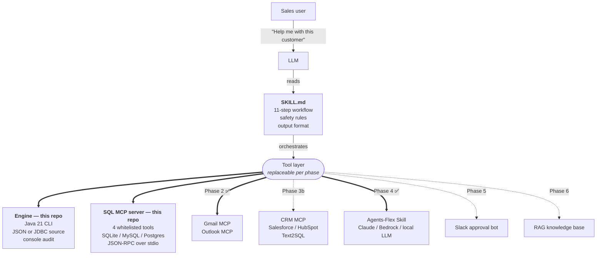
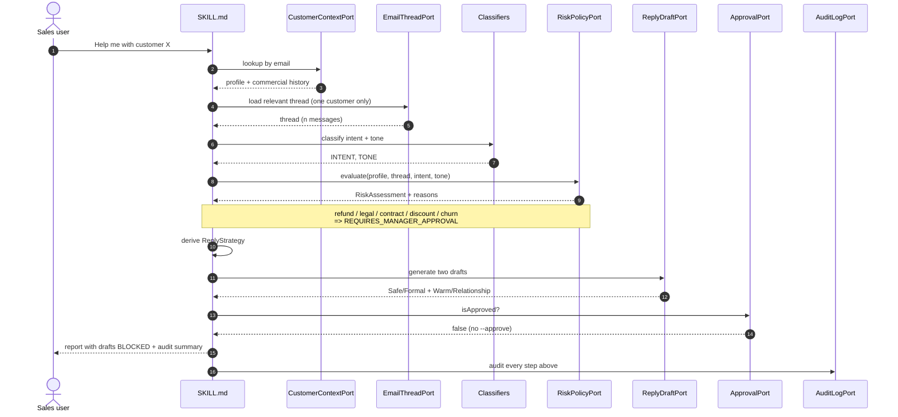
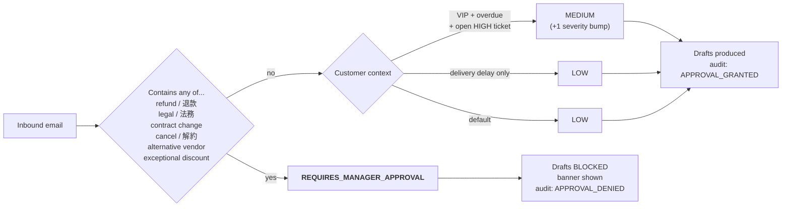

<p align="center">
  
</p>

<p align="center">
  <strong>English</strong> &nbsp;·&nbsp;
  <a href="README.zh-TW.md">繁體中文</a> &nbsp;·&nbsp;
  <a href="README.ja.md">日本語</a> &nbsp;·&nbsp;
  <a href="README.ko.md">한국어</a>
</p>

<p align="center">
  
  
  
  
  
  
</p>

<p align="center"><i>An AI sales copilot that reads your customer's email like a senior account manager would &mdash; context first, draft last, never hits send.</i></p>

---

## TL;DR

- A Java 21 copilot for B2B account managers. It loads the customer's profile and commercial history first, reads only the relevant thread, classifies intent and tone, evaluates risk against an explicit policy, and produces two reply drafts plus follow-up actions.
- It is not a chatbot. It is context-grounded by design. Refunds, legal language, contract concessions, exceptional discounts, cancellation talk, and churn signals on VIP accounts force a hard manager-approval gate that **blocks the drafts**.
- Run it in 60 seconds with the stock JDK, no dependencies, no credentials, no network &mdash; see [Run it](#run-it-in-60-seconds).

## Vision

The goal of Sales AI is to ship a **24/7 automated AI agent focused on the sales function** &mdash; a sales engine that never clocks out.

It doesn't lock you into one industry. **Plug in your existing customer database, meeting notes, contract archive, and CRM system**, and this agent will respond to customer email like a senior account manager around the clock &mdash; the daytime inquiry, the midnight refund request, the weekend renewal question, all caught in the first window. Manufacturing, finance, SaaS, cross-border e-commerce, B2B services &mdash; **wherever your customers write to you, this agent fits**.

### What's coming next

- **Phase 4 &mdash; Proactive outreach.** Not just inbound replies. Overdue proposals, contracts about to expire, accounts showing churn signals &mdash; the agent drafts the message, orders the priority, schedules the follow-up.
- **Phase 5 &mdash; Cross-channel messaging.** Beyond email: LinkedIn, WhatsApp, LINE OA, Slack, the website chat widget, social-media DMs &mdash; same customer context, consistent voice across channels.
- **Phase 6 &mdash; Autonomous closing.** Within manager-defined price bands, contract templates, and discount authorities, the agent runs the full loop &mdash; quote, negotiate, sign, log to CRM &mdash; without a human in the routine path.

### What this is worth to a company

- **Sales output stops being capped by headcount.** A 5,000-customer business that used to need 30 reps to keep coverage can run with 5 reps + AI and hit higher contact frequency.
- **Speed becomes a weapon.** Industry average reply time on a sales inquiry is 4&ndash;12 hours; this agent replies in 30 seconds. **Speed of reply is conversion.**
- **Institutional memory doesn't walk out the door.** When a rep leaves, they take customer history, talking points, and account context with them &mdash; every B2B company's biggest unforced loss. Sales AI lives in the database and shows up to work every day.
- **Managers spend their time where it matters.** Refunds, contract concessions, VIP risk &mdash; those need a signature. The other 80% of routine email no longer eats their calendar.
- **Auditable by default.** Regulated industries (banking, insurance, healthcare) cannot run a black-box agent. Every Sales AI step writes one audit line; the regulator, the board, and the external auditor can all read what happened and **why**.

Today we ship a context-first MVP with a hard manager-approval gate. As phases progress, the gate narrows and the autonomous portion grows &mdash; but **the gate never disappears**. That is our safety promise.

## Why Java

Not because Java is trendy. Because this project's destination *is* Java's home turf.

| Reason | How it shows up in this codebase |
|---|---|
| **B2B enterprise IT runs on Java** | Banks, insurers, manufacturing, ERP/CRM backends &mdash; ~90% Java/Spring. Embedding this agent next to existing services in the same process, sharing the same audit log, sharing the same DI container &mdash; far less friction than a Python sidecar. |
| **JDK 21 + zero dependencies = 60-second reproduce** | No `pip install` resolving conflicts, no venv, no `node_modules` black hole. `git clone && javac && java` &mdash; three steps, done. Python and Node can't ship that cleanly. |
| **Records + sealed types fit the domain model** | The 13 domain records are smaller than Python `@dataclass` equivalents and safer &mdash; compile-time null checks, exhaustive enum coverage, switch expressions forcing every case. |
| **Auditability is regulatory, not nice-to-have** | A red line like refund/legal/contract gets compile-time guaranteed coverage in [`RiskRules.java`](src/main/java/com/example/salesai/risk/RiskRules.java). A missing `if/elif` branch in Python passes silently; Java's compiler refuses. |
| **Complementary to the MCP ecosystem** | Most MCP servers are TS/Python &mdash; fine, the tool layer is language-agnostic. `SKILL.md` is the agent; the engine's language doesn't matter to the user. Choosing Java is a strategic bet on "easy to embed inside enterprise Java backends." |

"AI agent in Java" is a scarce category on GitHub (~95% of public AI agent code is Python). For enterprise IT teams already on a Java stack, an agent that drops into their existing backend is a meaningful differentiator, not a liability.

## What makes this different

| | What it brings | Why it matters |
|---|---|---|
| **Skill is the agent** | The user-facing agent lives in [`SKILL.md`](skills/sales-ai/SKILL.md), not in code. The Java MVP is just the engine. | Replace the engine (Java CLI &rarr; Gmail MCP &rarr; CRM MCP) phase by phase without changing how Claude Code calls it. |
| **Hard safety gate** | Refund / legal / contract / discount / churn signals force `REQUIRES_MANAGER_APPROVAL` and **block the drafts**. | Other agent demos rely on the model "behaving"; this one literally has no SMTP code in the build. It cannot send mail even by accident. |
| **Context-first, not prompt-first** | Customer profile, contract, payments, tickets, AM notes load **before** the model sees the email. | A senior AM does this in their head. LLMs need it written down. |
| **Auditable by construction** | Every port call writes one audit line; the CLI prints them at the bottom of every report. | If a decision looks wrong, read backwards from the report to the inputs. |
| **Bilingual classification** | Keyword scorer handles English + 繁體中文 in the same pass. Designed for the next two languages to drop in. | Built for Asia-Pacific B2B mail, not US-only fixtures. |
| **Zero dependencies, reproducible in 60 seconds** | Stock JDK 21, no Maven, no Gradle, no LLM key, no network. | `git clone && javac && java` and you have the demo. No supply chain. No surprises. |

## Architecture: the Skill is the agent

> **The Skill is the agent. The Java MVP is the engine, replaceable per phase.**



The same `SKILL.md` runs every phase. The bold lines are what ships in this repo today: the Java engine and the SQL MCP server with four whitelisted query tools. The dotted lines are future replacements — Gmail / Outlook MCP, a real CRM, an LLM behind the draft port. **The 11-step workflow and the safety rules do not change between phases** &mdash; only the implementations behind the ports move. That is the whole point.

This is what makes the project useful as a study piece, not just as a demo: the engine you read today is exactly the engine that an MCP-backed production deployment will eventually replace, port by port. See [`docs/integration-plan.md`](docs/integration-plan.md) for the full migration map.

## The 11-step workflow



In plain language, the same eleven steps the diagram traces:

1. Identify the customer (by id or by email, from CLI args).
2. Load the customer's commercial profile: tier, contract status, payment status, recent orders, open tickets, account-manager notes.
3. Load the relevant email thread for that customer. One thread, never the inbox.
4. Summarise the thread factually: who said what, when, what is being asked, what has already been promised.
5. Classify business intent into one of `INQUIRY`, `QUOTATION`, `COMPLAINT`, `RENEWAL`, `PAYMENT_ISSUE`, `DELIVERY_DELAY`, `TECHNICAL_SUPPORT`, `NEGOTIATION`, `CHURN_RISK`, `UNKNOWN`.
6. Classify emotional tone: neutral, frustrated, escalating, conciliatory, urgent, or formal.
7. Evaluate risk against the explicit policy. Refund / legal / contract / exceptional discount / cancellation / churn-on-VIP all force `REQUIRES_MANAGER_APPROVAL`.
8. Decide a reply strategy in one or two sentences: acknowledge, commit, defer, escalate, ask for time.
9. Generate two reply drafts: Option A is safe and formal, Option B is warm and relationship-focused. Both respect the customer's preferred language.
10. Surface the approval gate. If the risk decision blocks the drafts, the report shows them as `[BLOCKED — manager approval required]` with the proposed wording quoted for review.
11. Render the report and an audit summary listing every port call. Optionally record the interaction back to CRM.

## Risk decision flow



Refund / legal / contract / cancellation language is a **hard stop**, regardless of customer tier or tone. The model never gets to override this gate &mdash; the rule lives in [`risk/RiskRules.java`](src/main/java/com/example/salesai/risk/RiskRules.java) and is the first thing a reviewer reads. The full policy lives in [`docs/safety-rules.md`](docs/safety-rules.md).

## Sample output

The bundled demo ships a representative case: Wei-Ming Chen, the procurement lead at Lumora Robotics Co., Ltd. (a VIP customer with overdue payment), is asking for a partial refund and credit on a delayed order, with the August renewal now in question.

The block below is the **actual stdout** of `java -cp out com.example.salesai.SalesAiCli` against the bundled samples &mdash; not a screenshot, not a hand-edited mock. Everything you see is produced by the deterministic workflow in [`app/AdvisorWorkflow.java`](src/main/java/com/example/salesai/app/AdvisorWorkflow.java) and rendered by [`app/AdvisorReportRenderer.java`](src/main/java/com/example/salesai/app/AdvisorReportRenderer.java). The full transcript also lives at [`samples/advisor-output.md`](samples/advisor-output.md).

```
=== Sales AI — Report ===
!! DRAFTS ARE BLOCKED — manager approval required before this reply can leave the building !!

Customer Context
- Name: Wei-Ming Chen
- Company: Lumora Robotics Co., Ltd.
- Tier: VIP
- Contract status: ACTIVE (renews 2026-08-31)
- Payment status: OVERDUE_30D
- Recent orders:
    * SO-2026-0188 — 2026-04-12 — $42000 — DELIVERED (On-time delivery, signed acceptance)
    * SO-2026-0231 — 2026-04-29 — $18500 — DELAYED (Logistics partner missed ETA by 9 days)
- Recent support state:
    * SUP-7781 [HIGH] since 2026-04-25: Vision module misalignment after firmware 4.2 rollout

Email Summary
- Subject: Order SO-2026-0231 delay + firmware issue — refund expected
- Current intent: TECHNICAL_SUPPORT
- Emotional tone: URGENT
- Key customer ask: Kelly, four days, no plan. Our CTO is now in the loop and is asking about the renewal in August. Please confirm by tomorrow: (1) revised delivery date, (2) refund or credit amount, (3) firmware fix ETA. Otherwise we will pause the renewal d...

Risk Assessment
- Risk level: REQUIRES_MANAGER_APPROVAL
- Reasons:
    * Customer signalled churn risk (mentioned alternative vendors / pause renewal / cancel).
    * Customer asked for refund or credit.
    * VIP customer has an overdue payment (OVERDUE_30D).
    * Customer has an open HIGH-priority support ticket.
- Requires manager approval: YES

Recommended Reply Strategy
- Tone: formal, careful, no commitments (the customer is signalling urgency — acknowledge time pressure explicitly)
- Position: acknowledge, no commitments yet, escalate
- Avoid saying:
    * Promising any contractual concession without manager approval
    * Confirming a refund or credit amount in the reply
- Allowed commitments:
    * Acknowledge receipt and the urgency of the situation today
    * Pull together logistics, engineering, and account management within 24 hours
    * Provide a written status update with concrete dates by end of next business day
- Next best action: Hand off to Kelly Wu with full context; do not reply until approved

Draft Option A: Safe / Formal
Subject: Re: Order SO-2026-0231 delay + firmware issue — refund expected — recovery plan
Body:
Dear Wei-Ming Chen,

Thank you for the directness of your message. I take the points you raised seriously, and I want to address them in order.
I understand the impact this has had on your operations and on your team's confidence in us.

Here is what I can confirm today:
  - Acknowledge receipt and the urgency of the situation today
  - Pull together logistics, engineering, and account management within 24 hours
  - Provide a written status update with concrete dates by end of next business day

Because some of the items you raised — in particular any commercial concession — fall outside what I can confirm in writing today, I am bringing them to Kelly Wu's attention so we can come back to you with a single, signed-off response.

Please consider this message a status update rather than a final commercial response.

Next step from our side: Hand off to Kelly Wu with full context; do not reply until approved

Best regards,
Kelly Wu

Draft Option B: Warm / Relationship-Focused
Subject: Re: Order SO-2026-0231 delay + firmware issue — refund expected — recovery plan
Body:
Hi Wei-Ming Chen,

Thanks for being so direct with me — I'd much rather hear it this way than find out later. Let me address each point.
I know this hasn't been the experience you expected from us, and I'm not going to pretend otherwise.

Here is what I can lock in for you right now:
  - Acknowledge receipt and the urgency of the situation today
  - Pull together logistics, engineering, and account management within 24 hours
  - Provide a written status update with concrete dates by end of next business day

On the commercial side (anything that looks like a refund, credit, or change to the contract), I want to be honest: I won't commit to a number in this email until Kelly Wu has signed it off — that's how we keep our promises clean.

Treat this as me keeping you in the loop, not as the final word on the commercial side.

What I'm doing next: Hand off to Kelly Wu with full context; do not reply until approved

Talk soon,
Kelly Wu

Follow-Up Actions
- Brief the manager — owner: Kelly Wu, due: today
    Walk the manager through the inbound message, the risk reasons, and the proposed reply before any draft leaves the building.
- Engineering update on open ticket — owner: Engineering lead, due: within 48 hours
    Confirm a firmware fix ETA for the open HIGH-priority ticket and write it up in customer-friendly language.
- Schedule executive check-in — owner: Kelly Wu, due: this week
    VIP customer — set up a short call with our account exec to keep the relationship anchored.

Audit Summary
- [...] LOOKUP_CUSTOMER: email=wm.chen@lumora-robotics.example
- [...] LOAD_THREAD: customerEmail=wm.chen@lumora-robotics.example
- [...] CLASSIFY_INTENT: thread=THR-90188
- [...] INTENT_CLASSIFIED: TECHNICAL_SUPPORT
- [...] CLASSIFY_TONE: thread=THR-90188
- [...] TONE_CLASSIFIED: URGENT
- [...] EVALUATE_RISK: intent=TECHNICAL_SUPPORT tone=URGENT
- [...] RISK_LEVEL: REQUIRES_MANAGER_APPROVAL requiresManagerApproval=true
- [...] DECIDE_STRATEGY: level=REQUIRES_MANAGER_APPROVAL
- [...] GENERATE_DRAFTS: tone=formal, careful, no commitments
- [...] RECOMMEND_FOLLOWUPS: intent=TECHNICAL_SUPPORT
- [...] EVALUATE_APPROVAL: requiresManagerApproval=true
- [...] APPROVAL_DENIED: manager flag=false; reasons=[...]
- [...] CRM_RECORD: customerId=CUST-1042 summary=...; drafts BLOCKED

=== End of Report ===
```

Re-running with `--approve` does NOT send mail. It writes one extra audit line recording the approval (`APPROVAL_GRANTED`), drops the BLOCKED banner, and changes the closing CRM record to `drafts READY`. A human still has to copy the wording, paste it into the mail client, read it once more, and press send. That is intentional friction. See [`docs/safety-rules.md`](docs/safety-rules.md).

> **Drafts are in English** in the MVP because the template adapter is deterministic. Generating drafts in the customer's preferred language (here `zh-TW`) is part of Phase 4 &mdash; see [`docs/integration-plan.md`](docs/integration-plan.md) &mdash; when `TemplateReplyDraftAdapter` is replaced by an LLM-backed Agents-Flex Skill. The strategy and risk decisions stay language-agnostic so they remain auditable.

## Real integrations (Phase 2 + Phase 4)

The mock-mode 60-second demo still works exactly as before. To run against
real systems, use these opt-in flags:

| Flag | Effect | Doc |
|---|---|---|
| `--email-mcp gmail\|outlook` | Real email via spawned MCP server | docs/integrations/{gmail,outlook}.md |
| `--mcp-config <path>` | Override default mcp-config.json location | — |
| `--llm anthropic\|openai\|gemini` | Real LLM-drafted replies | docs/integrations/{anthropic,openai,gemini}.md |
| `--llm openai-compatible --llm-endpoint URL` | **Local LLM** — keep customer data on your perimeter | docs/integrations/local-llm.md |
| `--llm-model <id>` | Override provider default model | — |

### Honest deployment notes

- **Java engine remains zero-dep at runtime** — `java.net.http` is built into JDK 11+, so the LLM HTTP calls add no JARs.
- **Phase 2 deployment requires Node.js or `uvx`** — Gmail/Outlook MCP servers are external npm/pip packages spawned as child processes. The Java engine itself stays zero-dep; the dependency is for the email source.
- **When using cloud LLM, customer email content is sent to that provider** (Anthropic/OpenAI/Google). For regulated industries (banking, insurance, manufacturing, ERP) where data must stay on-premise: use `--llm openai-compatible` with a local model — see `docs/integrations/local-llm.md`.
- **Risk gate is enforced in code**: when `RiskAssessment.level().blocksAutoDraft()` is true OR `requiresManagerApproval` is true, the LLM is **never invoked**. Customer data does not leave the engine for high-risk situations. This is verified by `AdvisorWorkflowRiskGateTest`.

## Run it in 60 seconds

You need a stock JDK 21 and nothing else. No build tool. No network. No credentials.

**PowerShell (Windows):**

```powershell
javac -d out (Get-ChildItem -Recurse src/main/java/*.java | %{$_.FullName})
java -Dstdout.encoding=UTF-8 -cp out com.example.salesai.SalesAiCli
```

> On Windows, `-Dstdout.encoding=UTF-8` makes em-dashes and 中文 render correctly even when the console code page is not 65001. Drop the flag if you have already run `chcp 65001`.

**bash (macOS / Linux / WSL / Git Bash):**

```bash
find src/main/java -name '*.java' | xargs javac -d out
java -cp out com.example.salesai.SalesAiCli
```

The CLI takes a small set of flags. All are optional; the defaults point at the bundled samples.

| Flag | Meaning |
|------|---------|
| `--customer-profile <path>` | Path to the customer profile JSON. Defaults to `samples/customer-profile.json`. |
| `--email-thread <path>` | Path to the email thread JSON. Defaults to `samples/email-thread.json`. |
| `--approve` | Marks the report as manager-approved. Writes an extra audit line; unblocks display of drafts. Does NOT send mail. |
| `--db <jdbc-url>` | Load the customer profile from a JDBC database instead of JSON. Pairs with `--db-user` / `--db-password`. Requires `--email`. |

## Phase 2 preview: SQL MCP Server

The repo also ships an opt-in MCP server that exposes the same customer data as **whitelisted SQL-backed tools** for Claude Code (or any MCP client) to call directly. JSON-RPC 2.0 over stdin/stdout, four tools, no generic SQL surface.

```
┌──────────────┐  stdio JSON-RPC  ┌─────────────────────┐  JDBC  ┌──────────┐
│ LLM          │ ───────────────▶ │ SalesMcpServer      │ ─────▶ │ SQLite / │
│ (MCP client) │ ◀─────────────── │  4 whitelisted tools│        │ MySQL /  │
└──────────────┘                  └─────────────────────┘        │ Postgres │
                                                                  └──────────┘
```

| MCP tool | What it does | Backed by |
|---|---|---|
| `customer.findByEmail` | One customer by primary email (exact, case-insensitive) | one prepared `SELECT` |
| `customer.findById` | One customer by id, e.g. `CUST-1042` | one prepared `SELECT` |
| `customer.listOrders` | Recent orders for one customer, capped at 50 | one prepared `SELECT` |
| `customer.listOpenTickets` | Open support tickets for one customer | one prepared `SELECT` |

**There is no `runSql(query)` tool, and there will not be one.** The whitelist is the safety boundary that honours the "scoped reads" promise in [`SKILL.md`](skills/sales-ai/SKILL.md). Prompt injection arriving in customer email cannot widen the agent's data access — adding a tool requires a code change.

### 90-second demo (SQLite, zero infrastructure)

```powershell
# 1. Download the SQLite JDBC driver into mcp-server/lib/
Invoke-WebRequest `
  -Uri 'https://repo1.maven.org/maven2/org/xerial/sqlite-jdbc/3.42.0.1/sqlite-jdbc-3.42.0.1.jar' `
  -OutFile 'mcp-server/lib/sqlite-jdbc-3.42.0.1.jar'

# 2. Compile the MCP server
$src = Get-ChildItem -Recurse mcp-server/src/main/java -Filter *.java | %{ $_.FullName }
javac -d mcp-server/out -Xlint:all $src

# 3. Seed a demo SQLite DB with the same Lumora Robotics scenario
java -cp 'mcp-server/lib/sqlite-jdbc-3.42.0.1.jar;mcp-server/out' `
     com.example.salesai.mcp.SeedData

# 4. Re-run the engine, this time pointed at the SQLite DB
java -Dstdout.encoding=UTF-8 `
     -cp 'out;mcp-server/lib/sqlite-jdbc-3.42.0.1.jar' `
     com.example.salesai.SalesAiCli `
     --db jdbc:sqlite:mcp-server/demo.db `
     --email wm.chen@lumora-robotics.example
```

Same report, same risk decision, same blocked drafts &mdash; this time sourced from real `SELECT` statements. To wire the MCP server into Claude Code itself (so the LLM can call the tools, not just the engine), see [`mcp-server/README.md`](mcp-server/README.md). For the design rationale &mdash; why whitelisting, why stdio, why ship our own server when generic DB MCPs exist &mdash; see [`docs/mcp-server.md`](docs/mcp-server.md).

## Why this is not a chatbot

A chatbot is prompt-first: the user types something, the model reads it, the model replies. Context is whatever scrolls back in the conversation, possibly augmented with retrieved snippets. The model's job is to respond to the message in front of it.

A sales copilot is **context-first**. Before the model sees the customer's email at all, the agent loads the customer's tier, their contract status, their payment status, their recent orders, their open support tickets, and the account manager's notes. The email is read against that backdrop. The risk evaluation is performed against that backdrop. The drafts are composed against a redacted projection of that backdrop. The order matters: a chatbot reads the email and then asks "do I happen to know who this is?". A copilot answers "who this is" before it reads anything.

There is also a **hard safety boundary**. A refund request, a legal mention, a contract concession, an exceptional discount, a cancellation, or a churn signal on a VIP account forces the manager-approval gate. The drafts are produced, but they are blocked. The audit trail explains exactly why. A chatbot has no such gate; this agent has one as its first-class output.

The audit trail itself is the third thing chatbots typically do not have. Every port call writes one line. The CLI prints the audit summary at the bottom of every report. If a decision in the report looks wrong, you can read backwards from the conclusion through the steps that produced it. **The model is legible.**

## Port &rarr; MCP migration

The full architecture lives in [`docs/architecture.md`](docs/architecture.md). The short version: hexagonal layout, no DI framework, Java 21 records for the domain, a hand-rolled JSON reader instead of Jackson or Gson, and a clean port &rarr; MCP mapping that drives the entire roadmap.

| Port | Future replacement |
|------|--------------------|
| `CustomerContextPort` | CRM MCP server, Text2SQL on customer DB |
| `EmailThreadPort` | Gmail MCP / Outlook MCP / IMAP MCP |
| `RiskPolicyPort` | Policy engine, eventually LLM with structured output |
| `ReplyDraftPort` | LLM via Agents-Flex Skill |
| `CrmPort` | CRM MCP write operations |
| `ApprovalPort` | Slack approval bot, ticketing system |
| `AuditLogPort` | OpenTelemetry, Splunk, internal audit DB |

Each phase of [`docs/integration-plan.md`](docs/integration-plan.md) replaces one or two of these ports. The other packages do not move.

## Roadmap

- [x] **Phase 1 &mdash; MVP.** Mock adapters, deterministic classifiers, console audit. This repo.
- [x] **Phase 2 &mdash; Real email.** ✅ Replace `MockEmailThreadAdapter` with Gmail MCP / Outlook MCP via `--email-mcp`. Reads remain customer-scoped.
- [x] **Phase 3a &mdash; Real database.** `JdbcCustomerContextAdapter` + a SQL MCP server with four whitelisted query tools. SQLite for the demo, MySQL / Postgres schemas committed. See [`mcp-server/`](mcp-server/) and [`docs/mcp-server.md`](docs/mcp-server.md).
- [ ] **Phase 3b &mdash; Production CRM.** Point the same JDBC adapter and the same MCP tools at a real CRM (Salesforce, HubSpot) once Text2SQL is in scope.
- [x] **Phase 4 &mdash; Real LLM drafts.** ✅ Replace `TemplateReplyDraftAdapter` with `--llm anthropic|openai|gemini` or `--llm openai-compatible` for a local model. Prompt caching on the stable preamble.
- [ ] **Phase 5 &mdash; Approval routing.** Replace `ManualApprovalAdapter` with a Slack approval bot or a ticketing-system integration.
- [ ] **Phase 6 &mdash; Knowledge base / RAG.** Plug a vector store of past won / lost playbooks behind a new port.
- [ ] **Phase 7 &mdash; Spring Boot service.** Wrap the workflow in Spring Boot, expose it as an MCP server other Claude Code skills can call.

The detailed shape of each phase, the new safety considerations it introduces, and the OAuth scopes we deliberately do NOT request are in [`docs/integration-plan.md`](docs/integration-plan.md).

## Borrowed patterns, not borrowed code

The project owes a clear conceptual debt to several open-source efforts. **None of their source code lives in this repo.**

- [Agents-Flex](https://github.com/agents-flex/agents-flex) &mdash; Java agent framework. We adopted the Skill-as-spec philosophy and a port / adapter shape that mirrors how an Agents-Flex Skill will plug in at Phase 4. We did not copy any source file, package layout, or class name.
- [marlinjai/email-mcp](https://github.com/marlinjai/email-mcp) &mdash; unified email MCP across providers. We adopted the single-port-across-providers shape for `EmailThreadPort`. We do not ship an MCP server; we plan to consume one.
- Public Gmail MCP server examples &mdash; read thread, read message, create draft, send-after-approval. We adopted thread-scoped reads, drafts-before-sends, and the approval-before-write posture.
- Public CRM MCP server examples &mdash; get customer, recordInteraction-style writes. We adopted the read-mostly write surface and the structured-payload write shape.

We did not vendor, fork, or copy source code from any of these projects. The full per-project breakdown of what was adopted and what was explicitly not is in [`docs/borrowed-patterns.md`](docs/borrowed-patterns.md).

## Use it as a Claude Code skill

The agent definition lives in [`skills/sales-ai/SKILL.md`](skills/sales-ai/SKILL.md). Drop the `skills/sales-ai/` folder into your Claude Code skills directory (or use the project-local one), then ask Claude things like:

- "幫我看一下王經理那封信怎麼回。"
- "Take a look at the Lumora thread &mdash; Wei-Ming is asking for a refund."
- "Customer CUST-1042 just escalated. Walk me through it."

Claude will follow the eleven-step workflow in the Skill, call the bundled Java CLI as the tool layer, and surface the report. When the risk decision is `REQUIRES_MANAGER_APPROVAL`, Claude will tell you the drafts are blocked and stop until you grant approval explicitly.

## Documentation

| Doc | What's in it |
|-----|--------------|
| [`docs/architecture.md`](docs/architecture.md) | Hexagonal layout, package boundaries, why no DI, why a hand-rolled JSON reader, extension points. |
| [`docs/safety-rules.md`](docs/safety-rules.md) | Every red line, with the *why* and the *how it's enforced* for each. |
| [`docs/integration-plan.md`](docs/integration-plan.md) | Phase-by-phase migration toward MCP / Agents-Flex / Spring Boot. OAuth scopes we will and will not request. |
| [`docs/borrowed-patterns.md`](docs/borrowed-patterns.md) | Per-reference breakdown of patterns adopted and source code explicitly not copied. |
| [`docs/mcp-server.md`](docs/mcp-server.md) | Design rationale for the SQL MCP server: why whitelist tools, why stdio, why ship our own. |
| [`mcp-server/README.md`](mcp-server/README.md) | How to compile, seed, and wire the MCP server into Claude Code. |
| [`samples/advisor-output.md`](samples/advisor-output.md) | Both runs (default + `--approve`) verbatim. |
| [`skills/sales-ai/SKILL.md`](skills/sales-ai/SKILL.md) | The agent definition. The actual product. |

## Build this with us

If you want to help shape Sales AI from a GitHub demo into a real product &mdash; not just star and move on &mdash; get in touch.

I'm looking for:

- **B2B salespeople / account managers** who feel the daily pain of email + CRM + escalations and want to test-drive the copilot on their own workflows.
- **Java engineers** interested in productionising AI agents for enterprise environments (banking, insurance, manufacturing, ERP &mdash; the places where Java is already the lingua franca).
- **Investors and founding partners** who believe sales automation is the next wave and want to back the Java-first, audit-by-default approach.
- **Design partners** willing to pilot the agent inside their own sales team and shape the roadmap with real customer data.

📩 **a0925281767s@gmail.com**

Tell me which bucket you're in, what kind of customers you sell to, and what would make this useful for you. The fastest path from "interesting demo" to "shipping product" is to build it with the people who will actually use it.

## Contributing

Issues, suggestions, and counter-examples are welcome &mdash; particularly counter-examples. If you can find a request that this agent handles badly (a thread it misclassifies, an approval gate it should have triggered but did not, a draft that leaks an internal-only field), please open an issue with the input that produced the bad output. The safety rules in [`docs/safety-rules.md`](docs/safety-rules.md) are the product, and protecting them is the most useful contribution you can make.

## License

MIT. See [`LICENSE`](LICENSE).

## Suggested GitHub topics

`java` · `java21` · `ai-agent` · `email-copilot` · `sales-automation` · `mcp` · `agents-flex` · `claude-code` · `hexagonal-architecture` · `llm-tools` · `account-management` · `b2b`
