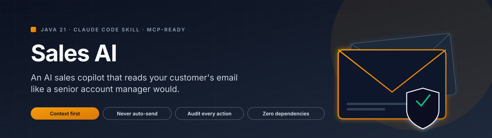
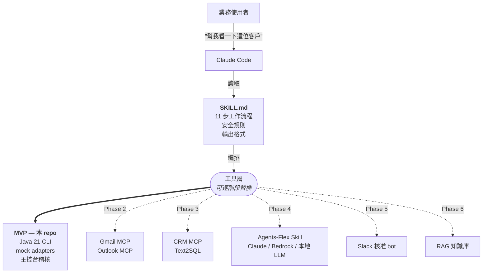
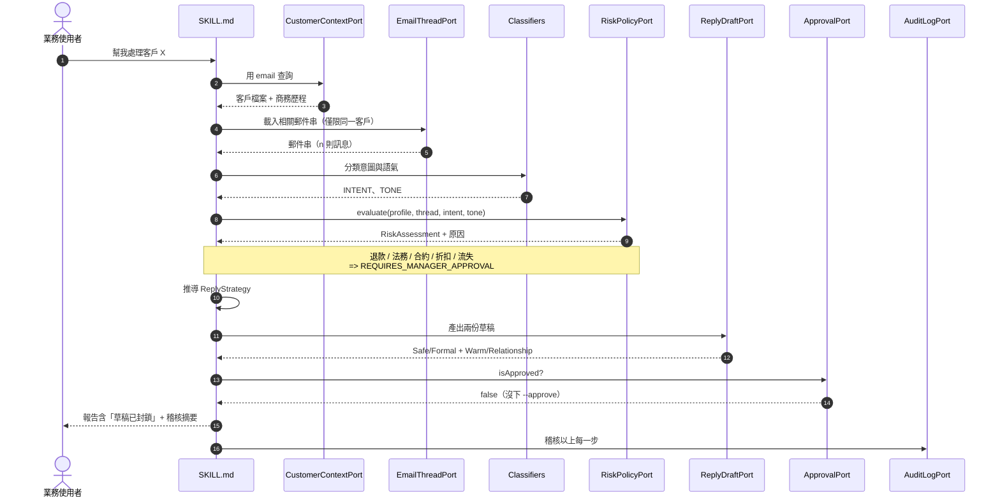
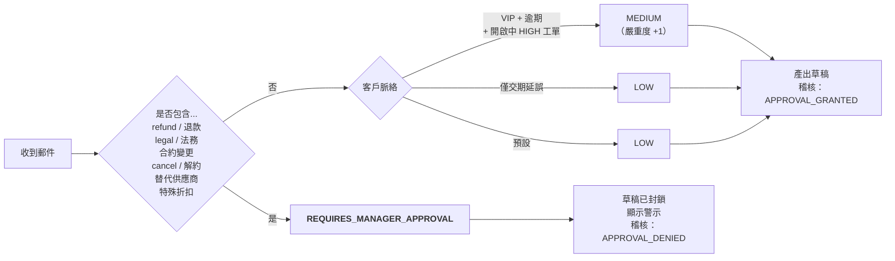

<p align="center">
  
</p>

<p align="center">
  <a href="README.md">English</a> &nbsp;·&nbsp;
  <strong>繁體中文</strong> &nbsp;·&nbsp;
  <a href="README.ja.md">日本語</a> &nbsp;·&nbsp;
  <a href="README.ko.md">한국어</a>
</p>

<p align="center">
  
  
  
  
  
  
</p>

<p align="center"><i>一款 AI 業務副駕駛，能像資深客戶經理那樣讀懂客戶來信——先看脈絡，最後才草擬回覆，絕不會自動寄出。</i></p>

---

## TL;DR

- 一款專為 B2B 客戶經理打造的 Java 21 副駕駛。它會先載入客戶的檔案與商務歷程，只讀取相關郵件串，分類意圖與語氣，依據明確的政策評估風險，最後產出兩份回覆草稿與後續行動建議。
- 它不是聊天機器人，而是設計上以脈絡為本。退款、法務用語、合約讓步、特殊折扣、解約話題，以及 VIP 客戶的流失訊號，都會強制觸發主管核准門檻並**封鎖草稿**。
- 使用標準 JDK，無依賴、無憑證、無網路，60 秒內即可執行——詳見 [60 秒上手](#60-秒上手)。

## 與眾不同之處

| | 它帶來什麼 | 為何重要 |
|---|---|---|
| **Skill 才是 agent 本體** | 面向使用者的 agent 寫在 [`SKILL.md`](skills/customer-email-sales-advisor/SKILL.md)，而不是程式碼裡。Java MVP 只是引擎。 | 引擎可以分階段抽換（Java CLI &rarr; Gmail MCP &rarr; CRM MCP），完全不影響 Claude Code 呼叫它的方式。 |
| **硬性安全門檻** | 退款／法務／合約／折扣／流失訊號會強制觸發 `REQUIRES_MANAGER_APPROVAL`，並**封鎖草稿**。 | 其他 agent 範例靠模型「自己乖一點」，這個專案則是建置產物中根本沒有 SMTP 程式碼，連意外寄信都做不到。 |
| **以脈絡為本，而非以提示為本** | 客戶檔案、合約、付款、工單、客戶經理筆記都會在模型讀到郵件**之前**載入。 | 資深客戶經理是在腦中完成這件事，LLM 則需要把這套流程明確寫下來。 |
| **天生可稽核** | 每一次 port 呼叫都會寫一行稽核紀錄，CLI 會把這些紀錄列在每份報告的最下方。 | 若報告中的判斷看起來不對勁，可以從報告往回追到原始輸入。 |
| **雙語分類** | 關鍵字評分器在同一道流程中同時處理英文與繁體中文，並已預留下兩種語言的擴充空間。 | 為亞太地區的 B2B 郵件而設計，而非僅限美國的範例。 |
| **零依賴，60 秒可重現** | 標準 JDK 21，沒有 Maven、沒有 Gradle、沒有 LLM 金鑰、沒有網路。 | `git clone && javac && java` 就能看到示範，沒有供應鏈、沒有意外。 |

## 架構：Skill 才是 agent 本體

> **Skill 才是 agent 本體；Java MVP 是引擎，可逐階段替換。**



同一份 `SKILL.md` 在每個階段都通用。今天它呼叫本 repo 的 Java CLI，明天就會改呼叫 Gmail/Outlook MCP 與 CRM MCP。**11 步工作流程與安全規則在不同階段之間不會改變**——只有 port 背後的實作會被替換。這正是整個設計的重點。

正因如此，這個專案才有研讀價值，而不只是 demo：你今天讀到的引擎，正是未來由 MCP 支撐的正式部署將會逐 port 替換掉的引擎。完整的遷移地圖請見 [`docs/integration-plan.md`](docs/integration-plan.md)。

## 11 步工作流程



用白話說明，跟上圖一樣的十一個步驟：

1. 識別客戶（從 CLI 參數，依 id 或 email 查詢）。
2. 載入客戶的商務檔案：等級、合約狀態、付款狀態、近期訂單、未結工單、客戶經理筆記。
3. 載入該客戶的相關郵件串。只讀一條串，絕不全收件匣翻找。
4. 用事實摘要這條串：誰在何時說了什麼、客戶在問什麼、我們已經承諾過什麼。
5. 將商業意圖分類為以下其一：`INQUIRY`、`QUOTATION`、`COMPLAINT`、`RENEWAL`、`PAYMENT_ISSUE`、`DELIVERY_DELAY`、`TECHNICAL_SUPPORT`、`NEGOTIATION`、`CHURN_RISK`、`UNKNOWN`。
6. 分類情緒語氣：中性、不滿、升溫、緩和、緊急、或正式。
7. 依據明確政策評估風險。退款／法務／合約／特殊折扣／取消／VIP 流失，全部強制觸發 `REQUIRES_MANAGER_APPROVAL`。
8. 用一兩句話決定回覆策略：致意、承諾、延後、上呈、爭取時間。
9. 產出兩份回覆草稿：Option A 安全且正式，Option B 溫暖且重視關係。兩者皆遵循客戶偏好的語言。
10. 呈現核准門檻。若風險判斷封鎖了草稿，報告會以 `[BLOCKED — manager approval required]` 顯示，並引述提案文字供審閱。
11. 渲染報告與稽核摘要，列出每一次 port 呼叫。可選擇將互動回寫到 CRM。

## 風險決策流程



退款／法務／合約／取消相關用語屬於**硬性中止**，不論客戶等級或語氣。模型沒有覆寫這道門檻的權限——這條規則寫在 [`risk/RiskRules.java`](src/main/java/com/example/salesadvisor/risk/RiskRules.java)，是審查者第一個會讀到的東西。完整政策請見 [`docs/safety-rules.md`](docs/safety-rules.md)。

## 範例輸出

預設示範附了一個具代表性的案例：陳偉銘，Lumora Robotics Co., Ltd.（一家有逾期付款的 VIP 客戶）的採購主管，正在針對一筆延誤的訂單要求部分退款與額度補償，八月的續約案也因此岌岌可危。

下面這段是 `java -cp out com.example.salesadvisor.SalesAdvisorCli` 配上預設 sample 的**真實 stdout**——不是截圖，也不是手動編修的假輸出。你看到的所有內容都由 [`app/AdvisorWorkflow.java`](src/main/java/com/example/salesadvisor/app/AdvisorWorkflow.java) 中的決定性工作流程產出，並由 [`app/AdvisorReportRenderer.java`](src/main/java/com/example/salesadvisor/app/AdvisorReportRenderer.java) 渲染。完整逐字稿也存放於 [`samples/advisor-output.md`](samples/advisor-output.md)。

```
=== Customer Email Sales Advisor — Report ===
!! DRAFTS ARE BLOCKED — manager approval required before this reply can leave the building !!

Customer Context
- Name: Wei-Ming Chen
- Company: Lumora Robotics Co., Ltd.
- Tier: VIP
- Contract status: ACTIVE (renews 2026-08-31)
- Payment status: OVERDUE_30D
- Recent orders:
    * SO-2026-0188 — 2026-04-12 — $42000 — DELIVERED (On-time delivery, signed acceptance)
    * SO-2026-0231 — 2026-04-29 — $18500 — DELAYED (Logistics partner missed ETA by 9 days)
- Recent support state:
    * SUP-7781 [HIGH] since 2026-04-25: Vision module misalignment after firmware 4.2 rollout

Email Summary
- Subject: Order SO-2026-0231 delay + firmware issue — refund expected
- Current intent: TECHNICAL_SUPPORT
- Emotional tone: URGENT
- Key customer ask: Kelly, four days, no plan. Our CTO is now in the loop and is asking about the renewal in August. Please confirm by tomorrow: (1) revised delivery date, (2) refund or credit amount, (3) firmware fix ETA. Otherwise we will pause the renewal d...

Risk Assessment
- Risk level: REQUIRES_MANAGER_APPROVAL
- Reasons:
    * Customer signalled churn risk (mentioned alternative vendors / pause renewal / cancel).
    * Customer asked for refund or credit.
    * VIP customer has an overdue payment (OVERDUE_30D).
    * Customer has an open HIGH-priority support ticket.
- Requires manager approval: YES

Recommended Reply Strategy
- Tone: formal, careful, no commitments (the customer is signalling urgency — acknowledge time pressure explicitly)
- Position: acknowledge, no commitments yet, escalate
- Avoid saying:
    * Promising any contractual concession without manager approval
    * Confirming a refund or credit amount in the reply
- Allowed commitments:
    * Acknowledge receipt and the urgency of the situation today
    * Pull together logistics, engineering, and account management within 24 hours
    * Provide a written status update with concrete dates by end of next business day
- Next best action: Hand off to Kelly Wu with full context; do not reply until approved

Draft Option A: Safe / Formal
Subject: Re: Order SO-2026-0231 delay + firmware issue — refund expected — recovery plan
Body:
Dear Wei-Ming Chen,

Thank you for the directness of your message. I take the points you raised seriously, and I want to address them in order.
I understand the impact this has had on your operations and on your team's confidence in us.

Here is what I can confirm today:
  - Acknowledge receipt and the urgency of the situation today
  - Pull together logistics, engineering, and account management within 24 hours
  - Provide a written status update with concrete dates by end of next business day

Because some of the items you raised — in particular any commercial concession — fall outside what I can confirm in writing today, I am bringing them to Kelly Wu's attention so we can come back to you with a single, signed-off response.

Please consider this message a status update rather than a final commercial response.

Next step from our side: Hand off to Kelly Wu with full context; do not reply until approved

Best regards,
Kelly Wu

Draft Option B: Warm / Relationship-Focused
Subject: Re: Order SO-2026-0231 delay + firmware issue — refund expected — recovery plan
Body:
Hi Wei-Ming Chen,

Thanks for being so direct with me — I'd much rather hear it this way than find out later. Let me address each point.
I know this hasn't been the experience you expected from us, and I'm not going to pretend otherwise.

Here is what I can lock in for you right now:
  - Acknowledge receipt and the urgency of the situation today
  - Pull together logistics, engineering, and account management within 24 hours
  - Provide a written status update with concrete dates by end of next business day

On the commercial side (anything that looks like a refund, credit, or change to the contract), I want to be honest: I won't commit to a number in this email until Kelly Wu has signed it off — that's how we keep our promises clean.

Treat this as me keeping you in the loop, not as the final word on the commercial side.

What I'm doing next: Hand off to Kelly Wu with full context; do not reply until approved

Talk soon,
Kelly Wu

Follow-Up Actions
- Brief the manager — owner: Kelly Wu, due: today
    Walk the manager through the inbound message, the risk reasons, and the proposed reply before any draft leaves the building.
- Engineering update on open ticket — owner: Engineering lead, due: within 48 hours
    Confirm a firmware fix ETA for the open HIGH-priority ticket and write it up in customer-friendly language.
- Schedule executive check-in — owner: Kelly Wu, due: this week
    VIP customer — set up a short call with our account exec to keep the relationship anchored.

Audit Summary
- [...] LOOKUP_CUSTOMER: email=wm.chen@lumora-robotics.example
- [...] LOAD_THREAD: customerEmail=wm.chen@lumora-robotics.example
- [...] CLASSIFY_INTENT: thread=THR-90188
- [...] INTENT_CLASSIFIED: TECHNICAL_SUPPORT
- [...] CLASSIFY_TONE: thread=THR-90188
- [...] TONE_CLASSIFIED: URGENT
- [...] EVALUATE_RISK: intent=TECHNICAL_SUPPORT tone=URGENT
- [...] RISK_LEVEL: REQUIRES_MANAGER_APPROVAL requiresManagerApproval=true
- [...] DECIDE_STRATEGY: level=REQUIRES_MANAGER_APPROVAL
- [...] GENERATE_DRAFTS: tone=formal, careful, no commitments
- [...] RECOMMEND_FOLLOWUPS: intent=TECHNICAL_SUPPORT
- [...] EVALUATE_APPROVAL: requiresManagerApproval=true
- [...] APPROVAL_DENIED: manager flag=false; reasons=[...]
- [...] CRM_RECORD: customerId=CUST-1042 summary=...; drafts BLOCKED

=== End of Report ===
```

加上 `--approve` 重跑也**不會**寄信。它只會多寫一行稽核紀錄（`APPROVAL_GRANTED`），拿掉 BLOCKED 警示，並把結尾的 CRM 紀錄改成 `drafts READY`。仍然需要真人把文字複製、貼進郵件用戶端、再讀一遍、然後按下寄送。這是刻意為之的摩擦設計。詳見 [`docs/safety-rules.md`](docs/safety-rules.md)。

> **MVP 中的草稿是英文**，因為樣板 adapter 是決定性的。改用客戶偏好語言（例如 `zh-TW`）來產草稿屬於 Phase 4——當 `TemplateReplyDraftAdapter` 被 LLM 支撐的 Agents-Flex Skill 取代時，請見 [`docs/integration-plan.md`](docs/integration-plan.md)。策略與風險判斷則維持與語言無關，以保持可稽核性。

## 60 秒上手

只需要標準 JDK 21，其餘什麼都不用：沒有建置工具、沒有網路、沒有憑證。

**PowerShell（Windows）：**

```powershell
javac -d out (Get-ChildItem -Recurse src/main/java/*.java | %{$_.FullName})
java -Dstdout.encoding=UTF-8 -cp out com.example.salesadvisor.SalesAdvisorCli
```

> 在 Windows 上，`-Dstdout.encoding=UTF-8` 可確保即便主控台代碼頁不是 65001，全形破折號與中文也能正確顯示。若已執行過 `chcp 65001`，可省略此 flag。

**bash（macOS / Linux / WSL / Git Bash）：**

```bash
find src/main/java -name '*.java' | xargs javac -d out
java -cp out com.example.salesadvisor.SalesAdvisorCli
```

CLI 接受少量 flag，全部選填；預設指向預載的 sample。

| Flag | 說明 |
|------|------|
| `--customer-profile <path>` | 客戶檔案 JSON 的路徑。預設為 `samples/customer-profile.json`。 |
| `--email-thread <path>` | 郵件串 JSON 的路徑。預設為 `samples/email-thread.json`。 |
| `--approve` | 將報告標記為「主管已核准」。會多寫一行稽核紀錄，並解除草稿封鎖。**不會**寄信。 |

## 為什麼這不是聊天機器人

聊天機器人是「以提示為本」：使用者輸入訊息、模型讀取、模型回覆。脈絡只是對話往上捲到的內容，外加可能檢索到的片段。模型的工作就是回應眼前那則訊息。

業務副駕駛則是**以脈絡為本**。在模型還沒看到客戶郵件之前，agent 就已經載入客戶等級、合約狀態、付款狀態、近期訂單、未結工單，以及客戶經理的筆記。郵件是放在這個背景下被讀的，風險評估是放在這個背景下進行的，草稿是依據這個背景的去敏化投影撰寫的。順序很關鍵：聊天機器人是先讀郵件再問「我認識這個人嗎？」；副駕駛則是在讀任何東西之前就先回答「這是誰」。

它還有**硬性的安全邊界**。退款請求、法務字眼、合約讓步、特殊折扣、解約、VIP 流失訊號，都會強制觸發主管核准門檻。草稿仍然會產出，但會被封鎖，稽核紀錄會清楚說明為什麼。聊天機器人沒有這道門檻，這個 agent 把它列為一級輸出。

第三件聊天機器人通常沒有的事是稽核紀錄本身。每次 port 呼叫都會寫一行，CLI 會在每份報告底部列出稽核摘要。如果報告中的判斷看起來不對勁，可以從結論回推到產生它的每一步。**模型是可閱讀的。**

## Port &rarr; MCP 遷移

完整架構請見 [`docs/architecture.md`](docs/architecture.md)。簡述如下：六角形（hexagonal）架構、不使用 DI 框架、以 Java 21 record 表達領域模型、以手寫 JSON reader 取代 Jackson 或 Gson，並以乾淨的 port &rarr; MCP 對應驅動整份藍圖。

| Port | 未來替換 |
|------|---------|
| `CustomerContextPort` | CRM MCP server，於客戶 DB 上的 Text2SQL |
| `EmailThreadPort` | Gmail MCP / Outlook MCP / IMAP MCP |
| `RiskPolicyPort` | Policy engine，最終為產出結構化輸出的 LLM |
| `ReplyDraftPort` | 透過 Agents-Flex Skill 呼叫的 LLM |
| `CrmPort` | CRM MCP 寫入操作 |
| `ApprovalPort` | Slack 核准 bot、票務系統 |
| `AuditLogPort` | OpenTelemetry、Splunk、內部稽核 DB |

[`docs/integration-plan.md`](docs/integration-plan.md) 的每一個階段都會替換掉一兩個 port，其餘 package 維持不動。

## 路線圖

- [x] **Phase 1 &mdash; MVP。** Mock adapters、決定性 classifier、主控台稽核。本 repo。
- [ ] **Phase 2 &mdash; 真實郵件。** 將 `MockEmailThreadAdapter` 換成 Gmail MCP / Outlook MCP，讀取仍然限縮在單一客戶範圍。
- [ ] **Phase 3 &mdash; 真實 CRM。** 將 `MockCustomerContextAdapter` 換成 CRM MCP 與客戶 DB 上的 Text2SQL。
- [ ] **Phase 4 &mdash; 真實 LLM 草稿。** 將 `TemplateReplyDraftAdapter` 換成呼叫 Claude / Bedrock / 本地 LLM 的 Agents-Flex Skill，並對穩定的前綴啟用 prompt caching。
- [ ] **Phase 5 &mdash; 核准路由。** 將 `ManualApprovalAdapter` 換成 Slack 核准 bot 或票務系統整合。
- [ ] **Phase 6 &mdash; 知識庫 / RAG。** 在新的 port 後面接上歷史成交／流失劇本的向量資料庫。
- [ ] **Phase 7 &mdash; Spring Boot 服務。** 將工作流程包進 Spring Boot，對外暴露為 MCP server，供其他 Claude Code skill 呼叫。

每個階段的細節形貌、新引入的安全考量，以及刻意**不**申請的 OAuth 範圍，都寫在 [`docs/integration-plan.md`](docs/integration-plan.md)。

## 借用模式，而非借用程式碼

本專案在概念上明顯欠了幾個開源專案的人情。**它們的原始碼一行也沒有出現在本 repo 中。**

- [Agents-Flex](https://github.com/agents-flex/agents-flex) &mdash; Java agent 框架。我們採用了「Skill 即規格」的哲學，以及一種 port／adapter 形貌，預先對齊 Phase 4 時 Agents-Flex Skill 接入的方式。我們沒有複製任何原始檔、套件結構或類別名稱。
- [marlinjai/email-mcp](https://github.com/marlinjai/email-mcp) &mdash; 跨多家供應商的統一郵件 MCP。我們採用了「同一個 port 跨多家供應商」的形貌套用到 `EmailThreadPort`。我們不出貨 MCP server，而是計劃消費它。
- 公開的 Gmail MCP server 範例 &mdash; 讀取串、讀取訊息、建立草稿、核准後寄送。我們採用了「以串為單位讀取」、「先草稿後寄送」、「先核准再寫入」的姿態。
- 公開的 CRM MCP server 範例 &mdash; 取得客戶、`recordInteraction` 風格的寫入。我們採用了「以讀取為主」的寫入面，以及「結構化 payload」的寫入形貌。

我們沒有從上述任何專案取出原始碼、分支或複製內容。每個專案具體採用了什麼、又明確沒有採用什麼，逐一條列在 [`docs/borrowed-patterns.md`](docs/borrowed-patterns.md)。

## 當作 Claude Code skill 使用

agent 定義位於 [`skills/customer-email-sales-advisor/SKILL.md`](skills/customer-email-sales-advisor/SKILL.md)。將 `skills/customer-email-sales-advisor/` 整個資料夾放進你的 Claude Code skills 目錄（或使用專案內的版本），然後可以這樣對 Claude 說：

- "幫我看一下王經理那封信怎麼回。"
- "Take a look at the Lumora thread &mdash; Wei-Ming is asking for a refund."
- "Customer CUST-1042 just escalated. Walk me through it."

Claude 會遵循 Skill 中的十一步工作流程，把預載的 Java CLI 當作工具層呼叫，並呈現報告。當風險判斷為 `REQUIRES_MANAGER_APPROVAL` 時，Claude 會明確告知草稿已封鎖，並停下來等你顯式給予核准。

## 文件

| 文件 | 內容 |
|------|------|
| [`docs/architecture.md`](docs/architecture.md) | 六角形架構、套件邊界、為何不使用 DI、為何手寫 JSON reader、擴充點。 |
| [`docs/safety-rules.md`](docs/safety-rules.md) | 每一條紅線，附上**為什麼**與**如何強制執行**。 |
| [`docs/integration-plan.md`](docs/integration-plan.md) | 朝向 MCP / Agents-Flex / Spring Boot 的逐階段遷移路線；會與不會申請的 OAuth 範圍。 |
| [`docs/borrowed-patterns.md`](docs/borrowed-patterns.md) | 逐專案拆解採用了哪些模式，又明確沒有複製哪些原始碼。 |
| [`samples/advisor-output.md`](samples/advisor-output.md) | 兩種執行（預設 + `--approve`）的逐字輸出。 |
| [`skills/customer-email-sales-advisor/SKILL.md`](skills/customer-email-sales-advisor/SKILL.md) | agent 定義，也是真正的產品。 |

## 貢獻

歡迎提出 issue、建議與反例——尤其是反例。如果你能找到本 agent 處理得很差的請求（誤分類的郵件串、本應觸發但沒觸發的核准門檻、洩漏內部欄位的草稿），請開一個 issue 並附上產生該錯誤輸出的輸入。 [`docs/safety-rules.md`](docs/safety-rules.md) 裡的安全規則就是本產品，捍衛它就是最有價值的貢獻。

## 授權

MIT。詳見 [`LICENSE`](LICENSE)。

## Suggested GitHub topics

`java` · `java21` · `ai-agent` · `email-copilot` · `sales-automation` · `mcp` · `agents-flex` · `claude-code` · `hexagonal-architecture` · `llm-tools` · `account-management` · `b2b`
